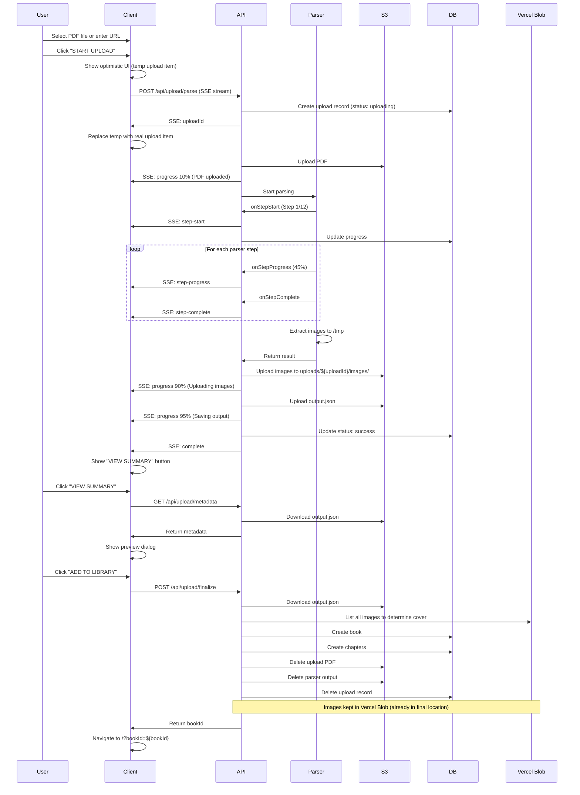
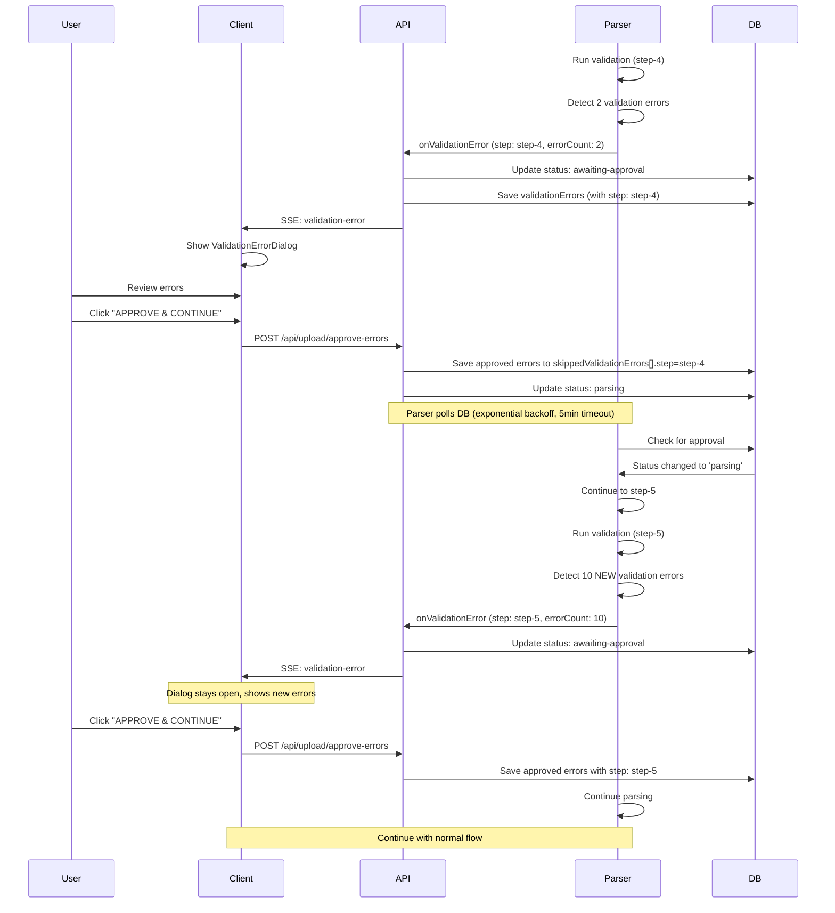
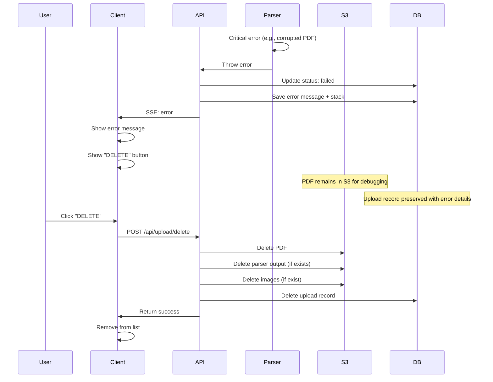
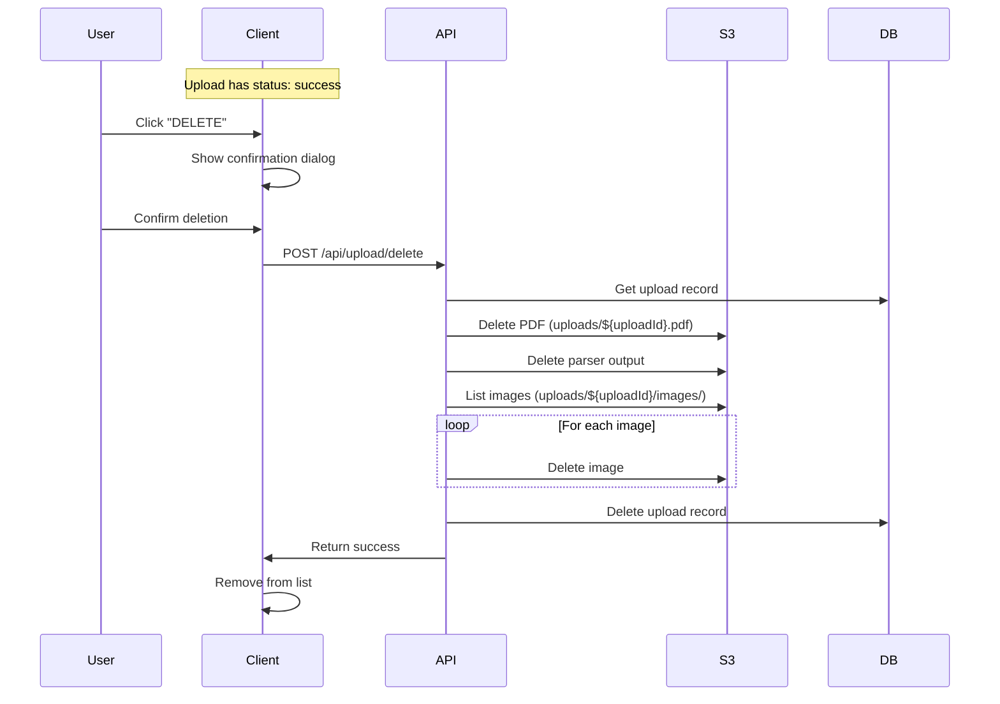

# Book Upload Feature - Complete Documentation

## Table of Contents
1. [Overview](#overview)
2. [Architecture](#architecture)
3. [User Flows](#user-flows)
4. [Technical Implementation](#technical-implementation)
5. [API Reference](#api-reference)
6. [Database Schema](#database-schema)
7. [S3 Storage Structure](#s3-storage-structure)
8. [Automatic File Expiration (24-Hour Cleanup)](#automatic-file-expiration-24-hour-cleanup)
9. [Error Handling](#error-handling)
10. [Troubleshooting](#troubleshooting)

---

## Overview

The Book Upload feature allows users to upload PDF books to their library. The system automatically parses the PDF, extracts text, images, chapters, links, and metadata, then allows users to review and approve the parsed content before adding it to their library.

### Key Features
- ✅ PDF upload (file or URL)
- ✅ Real-time parsing progress via Server-Sent Events (SSE)
- ✅ Automatic text extraction and chapter detection
- ✅ Image extraction and storage
- ✅ Validation error approval workflow
- ✅ Parser output preview before adding to library
- ✅ Persistent upload state (survives page reload)
- ✅ Automatic cleanup after finalization
- ✅ 24-hour file expiration with countdown timer (NEW)

---

## Architecture

### High-Level Components

```
┌─────────────────────────────────────────────────────────────────┐
│                          Client (React)                          │
│  ┌────────────────┐  ┌──────────────┐  ┌────────────────────┐  │
│  │  Upload Form   │  │  Upload List │  │  Preview Dialog    │  │
│  │  - File/URL    │  │  - Status    │  │  - Metadata        │  │
│  │  - Start       │  │  - Progress  │  │  - Chapters        │  │
│  └────────────────┘  └──────────────┘  └────────────────────┘  │
└─────────────────────────────────────────────────────────────────┘
                              │
                              │ SSE Stream + API Calls
                              ▼
┌─────────────────────────────────────────────────────────────────┐
│                      API Layer (Next.js)                         │
│  ┌────────────────┐  ┌──────────────┐  ┌────────────────────┐  │
│  │  /parse        │  │  /list       │  │  /finalize         │  │
│  │  (SSE Stream)  │  │  /status     │  │  /delete           │  │
│  │                │  │  /metadata   │  │  /approve-errors   │  │
│  └────────────────┘  └──────────────┘  └────────────────────┘  │
└─────────────────────────────────────────────────────────────────┘
                              │
                              ▼
┌─────────────────────────────────────────────────────────────────┐
│                      Parser (Node.js)                            │
│  ┌────────────────┐  ┌──────────────┐  ┌────────────────────┐  │
│  │  Text Extract  │  │  Chapter     │  │  Image Extract     │  │
│  │  PDF.js        │  │  Detection   │  │  pdfimages         │  │
│  └────────────────┘  └──────────────┘  └────────────────────┘  │
│  ┌────────────────┐  ┌──────────────┐  ┌────────────────────┐  │
│  │  Link Extract  │  │  Validation  │  │  Metadata Extract  │  │
│  └────────────────┘  └──────────────┘  └────────────────────┘  │
└─────────────────────────────────────────────────────────────────┘
                              │
                              ▼
┌─────────────────────────────────────────────────────────────────┐
│                    Storage & Database                            │
│  ┌────────────────┐  ┌──────────────────────────────────────┐  │
│  │  MongoDB       │  │  S3 (AWS)                            │  │
│  │  - bookUploads │  │  - PDFs                              │  │
│  │  - books       │  │  - Images                            │  │
│  │  - chapters    │  │  - Parser Output                     │  │
│  └────────────────┘  └──────────────────────────────────────┘  │
└─────────────────────────────────────────────────────────────────┘
```

---

## User Flows

### 1. Success Flow: Upload → Parse → Add to Library



### 2. Error Flow: Per-Step Validation Errors → Approval → Continue

**Important**: Validation errors are isolated per step. Approving errors in step-4 does NOT affect validation in step-5.



**Key Features:**
- ✅ **Per-Step Isolation**: Each validation step has independent approval
- ✅ **5-Minute Timeout**: Users have 5 minutes to review and approve errors
- ✅ **Seamless UX**: Dialog stays open across multiple validation steps
- ✅ **No Race Conditions**: SSE stream handles all state updates

### 3. Error Flow: Critical Parser Failure



### 4. User Flow: Delete Before Adding to Library



---

## Technical Implementation

### 1. Server-Sent Events (SSE) Stream

**File**: `src/pages/api/upload/parse.ts`

#### How SSE Works

SSE provides a one-way communication channel from server to client over HTTP. The server keeps the connection open and sends events as they occur.

**Key Configuration:**
```typescript
// Disable Next.js response buffering
export const config = {
    api: {
        bodyParser: { sizeLimit: '100mb' },
        responseLimit: false // Critical for SSE
    }
};

// Set SSE headers
res.setHeader('Content-Type', 'text/event-stream');
res.setHeader('Cache-Control', 'no-cache');
res.setHeader('Connection', 'keep-alive');
res.setHeader('X-Accel-Buffering', 'no'); // Disable nginx buffering

// Flush headers immediately
res.flushHeaders();
```

**Event Format:**
```typescript
function sendSSE(res: NextApiResponse, data: Record<string, unknown>): void {
    res.write(`data: ${JSON.stringify(data)}\n\n`);
    // Force immediate delivery
    if (typeof (res as any).flush === 'function') {
        (res as any).flush();
    }
}
```

**Event Types:**
- `upload`: Initial upload progress (5-15%)
- `step-start`: Parser step started
- `step-progress`: Parser step progress update
- `step-complete`: Parser step completed
- `validation-error`: Validation errors detected, awaiting approval
- `finalizing`: Post-parser operations (90-98%)
- `complete`: Upload completed successfully
- `error`: Critical error occurred
- `heartbeat`: Keep-alive ping (every 15s)

#### Client-Side SSE Handling

**File**: `src/client/routes/UploadBook/UploadBook.tsx`

```typescript
const response = await fetch('/api/upload/parse', {
    method: 'POST',
    headers: { 'Content-Type': 'application/json' },
    body: JSON.stringify({ pdfBase64, pdfUrl, fileName })
});

const streamReader = response.body!.getReader();
const decoder = new TextDecoder();

while (true) {
    const { done, value } = await streamReader.read();
    if (done) break;

    const text = decoder.decode(value);
    const lines = text.split('\n');

    for (const line of lines) {
        if (line.startsWith('data: ')) {
            const data = JSON.parse(line.substring(6));
            
            // Handle different event types
            switch (data.type) {
                case 'step-start':
                    // Update UI with current step
                    break;
                case 'validation-error':
                    // Show error review dialog
                    break;
                case 'complete':
                    // Mark as success
                    break;
            }
        }
    }
}
```

### 2. Parser Integration

**File**: `src/server/parser/productionRunner.ts`

The parser is a generic, reusable component that works in both local (CLI) and production (API) environments.

#### Parser Callbacks

The production runner provides callbacks to the parser for real-time updates:

```typescript
const onStepStart = async (stepName: string, stepNumber: number, totalSteps: number) => {
    const progress = Math.round((stepNumber / totalSteps) * 100);
    
    sendSSE(res, {
        type: 'step-start',
        step: stepName,
        stepNumber,
        totalSteps,
        progress
    });

    await updateBookUpload(uploadId, {
        currentStep: stepName,
        currentStepNumber: stepNumber,
        totalSteps,
        progress,
        status: 'parsing'
    });
};

const onValidationError = async (stepName: string, errorDetails: {
    step: string;
    errorCount: number;
    validationOutput: string;
    chapterErrorSummary?: string[];
}) => {
    // Save errors to database
    await updateBookUpload(uploadId, {
        status: 'awaiting-approval',
        validationErrors: [{
            step: errorDetails.step,
            message: `Step ${stepName} validation failed`,
            errorCount: errorDetails.errorCount,
            details: errorDetails.validationOutput,
            chapterErrorSummary: errorDetails.chapterErrorSummary || undefined
        }]
    });

    // Notify client
    sendSSE(res, {
        type: 'validation-error',
        step: stepName,
        errors: [/* ... */]
    });

    // Wait for user approval (polls DB with exponential backoff)
    const approved = await waitForApproval(uploadId, 60);
    return approved;
};
```

#### Approval Polling with Exponential Backoff

```typescript
async function waitForApproval(uploadId: string, timeoutMinutes: number): Promise<boolean> {
    const startTime = Date.now();
    const timeoutMs = timeoutMinutes * 60 * 1000;
    let pollInterval = 2000; // Start with 2 seconds
    const maxInterval = 10000; // Max 10 seconds

    while (Date.now() - startTime < timeoutMs) {
        const upload = await getBookUpload(uploadId);
        
        if (upload?.status === 'parsing') {
            return true; // User approved
        }
        
        if (upload?.status === 'failed') {
            return false; // User rejected or error occurred
        }

        await new Promise(resolve => setTimeout(resolve, pollInterval));
        
        // Exponential backoff
        pollInterval = Math.min(pollInterval * 1.5, maxInterval);
    }

    return false; // Timeout
}
```

### 3. Optimistic UI and Temp/Real Upload ID Flow

The upload feature uses an **optimistic UI pattern** to provide immediate feedback to users when they click "START UPLOAD", before the server creates the actual database record.

#### Why Optimistic UI?

Without optimistic UI, users would see nothing happen for several seconds after clicking "START UPLOAD" while:
1. The PDF is being encoded to base64 (for file uploads)
2. The HTTP request is sent to the server
3. The server creates a database record
4. The server starts the SSE stream

This delay creates a poor user experience. The optimistic UI pattern solves this by immediately showing a temporary upload item.

#### The Flow

**File**: `src/client/routes/UploadBook/UploadBook.tsx`

```typescript
const handleStartUpload = async () => {
    // 1. Generate temporary ID
    const tempUploadId = `temp-${Date.now()}`;
    
    // 2. Immediately add optimistic upload item to UI
    uploadManager.actions.addOptimisticUpload({
        uploadId: tempUploadId,
        status: 'uploading',
        createdAt: new Date(),
        fileName: uploadForm.getFileName(),
        currentStep: 'Uploading PDF...',
        progress: 0
    });
    setSelectedUploadId(tempUploadId);
    
    try {
        // 3. Start SSE upload (async)
        let realUploadId: string | null = null;
        
        await sseUpload.startUpload(
            {
                file: uploadForm.file,
                pdfUrl: uploadForm.pdfUrl,
                uploadMode: uploadForm.uploadMode,
                fileName: uploadForm.getFileName()
            },
            (event: SSEEvent) => {
                // 4. On first SSE event with real uploadId, replace temp
                const uploadId = uploadManager.actions.handleSSEEvent(
                    event, 
                    realUploadId ? undefined : tempUploadId // Only pass temp ID once
                );
                
                if (uploadId && !realUploadId) {
                    realUploadId = uploadId; // Store real ID
                    setSelectedUploadId(uploadId); // Update selected ID
                }
                
                // 5. Force immediate UI update on completion
                if (event.type === 'complete' && realUploadId) {
                    flushSync(() => {
                        uploadManager.actions.updateUpload(realUploadId!, {
                            status: 'success',
                            currentStep: undefined,
                            currentStepNumber: undefined,
                            progress: 100
                        });
                    });
                }
                
                return uploadId;
            }
        );
        
        uploadForm.reset();
        
    } catch (err) {
        // 6. Remove temporary upload on error
        uploadManager.actions.removeUpload(tempUploadId);
        setSelectedUploadId(null);
    }
};
```

#### Server-Side ID Generation

**File**: `src/pages/api/upload/parse.ts`

```typescript
export default async function handler(req: NextApiRequest, res: NextApiResponse) {
    // 1. Generate ObjectId for upload (will be used as DB _id)
    const uploadObjectId = new ObjectId();
    const uploadId = uploadObjectId.toString();
    
    // 2. Create minimal DB record immediately
    await createBookUpload({
        _id: uploadObjectId, // Use the same ObjectId
        userId: new ObjectId(user._id),
        pdfS3Key: '', // Will update later
        status: 'uploading',
        skippedValidationErrors: [],
        fileName: req.body.fileName || pdfUrl || 'Unknown'
    });
    
    // 3. Send uploadId via SSE immediately
    res.write(`data: ${JSON.stringify({ 
        type: 'upload', 
        uploadId,  // Real ID from database
        progress: 5, 
        message: 'Initializing...' 
    })}\n\n`);
    
    // ... continue with PDF upload and parsing
}
```

#### Client-Side Replacement Logic

**File**: `src/client/routes/UploadBook/hooks/useUploadManager.ts`

```typescript
const handleSSEEvent = useCallback((event: SSEEvent, tempUploadId?: string) => {
    const uploadId = event.uploadId;
    
    // If we have both real uploadId and temp uploadId, replace the temp item
    if (uploadId && tempUploadId) {
        replaceUpload(tempUploadId, {
            uploadId,  // Real ID from server
            status: 'parsing',
            createdAt: new Date(),
            fileName: uploadsRef.current.find(u => u.uploadId === tempUploadId)?.fileName,
            currentStep: event.message || 'Starting parser...',
            progress: event.progress || 5
        });
        
        // Don't process this event further (already set initial state)
        return uploadId;
    }
    
    // For subsequent events, just update the upload with real ID
    if (!uploadId) return null;
    
    updateUpload(uploadId, {
        status: 'parsing',
        currentStep: event.message || event.step,
        progress: event.progress
    });
    
    return uploadId;
}, [updateUpload, replaceUpload]);
```

#### Key Points

1. **Temp ID Format**: `temp-${Date.now()}` - Guaranteed unique, easy to identify
2. **Real ID Format**: MongoDB ObjectId string (24 hex characters)
3. **Replacement Timing**: On first SSE event that contains `uploadId`
4. **ID Consistency**: Server generates ObjectId and uses it for both DB `_id` and SSE `uploadId`
5. **Single Replacement**: The `tempUploadId` parameter is only passed for the first SSE event

#### Benefits

- ✅ **Instant Feedback**: User sees upload item immediately
- ✅ **No Flickering**: Smooth transition from temp to real ID
- ✅ **No Duplicates**: Old temp item is filtered out when real item is added
- ✅ **Persistent State**: Real ID matches database, survives page reload

#### Common Issues

**Problem**: Two items appear (one temp, one real)

**Cause**: Temp upload not being replaced

**Solution**: Ensure `tempUploadId` is only passed on first SSE event:
```typescript
realUploadId ? undefined : tempUploadId
```

**Problem**: UI shows "Starting parser... 0%" and never updates

**Cause**: SSE events missing `uploadId` field

**Solution**: Ensure all SSE events include `uploadId`:
```typescript
sendSSE(res, {
    type: 'step-start',
    uploadId,  // Must be included!
    step: stepName,
    progress: 50
});
```

### 4. Image Handling

#### Image Extraction (Parser)

**File**: `book-parser/parser/steps/03-2-image-extraction/03-2-image-extraction.js`

The parser extracts images using `pdfimages` command and saves them to a local temporary directory:

```javascript
const imagesDir = path.join(config.OUTPUT_DIR, 'images');
fs.mkdirSync(imagesDir, { recursive: true });

// Extract images using pdfimages
execSync(`pdfimages -j "${pdfPath}" "${imagesDir}/image"`);

// Result: image-001.jpg, image-002.png, etc.
```

#### Image Upload to S3 (Production Runner)

**File**: `src/server/parser/productionRunner.ts`

After parsing completes, images are uploaded directly to Vercel Blob in their final location:

```typescript
const imagesDir = path.join(result.outputDir, 'images');

if (fs.existsSync(imagesDir)) {
    const imageFiles = fs.readdirSync(imagesDir).filter(file => 
        /\.(jpg|jpeg|png|gif|webp)$/i.test(file)
    );
    
    // Sort images by filename (numerically) to ensure deterministic cover selection
    imageFiles.sort((a, b) => a.localeCompare(b, undefined, { numeric: true, sensitivity: 'base' }));
    
    // Get book title from parser output for folder naming
    const bookTitle = result.finalOutput?.metadata?.title || 'Unknown-Book';
    const bookFolderName = bookTitle.replace(/[^a-zA-Z0-9]/g, '-').replace(/-+/g, '-');
    const blobPrefix = `books/${bookFolderName}/images/`;
    
    // Upload each image to Vercel Blob
    await Promise.all(
        imageFiles.map(async (filename) => {
            const fileContent = fs.readFileSync(path.join(imagesDir, filename));
            const contentType = getContentType(filename);
            const blobKey = `${blobPrefix}${filename}`;
            
            await put(blobKey, fileContent, {
                access: 'public',
                contentType,
                token: BLOB_READ_WRITE_TOKEN,
                addRandomSuffix: false,
                allowOverwrite: true // Allow re-uploads
            });
        })
    );
    
    // Set imageBaseURL in metadata (relative path for Vercel Blob)
    imageBaseURL = `/${bookFolderName}/images/`;
}
```

**Key Points**:
- Images uploaded directly to **Vercel Blob** (not S3)
- Path: `books/BookTitle/images/` (final location, no moving needed)
- Images sorted before upload to ensure consistent cover selection
- `allowOverwrite: true` permits re-parsing the same book

#### Cover Image Selection on Finalization

**File**: `src/apis/upload/handlers/finalizeUploadHandler.ts`

When adding to library, cover image is determined by listing ALL images from Vercel Blob:

```typescript
// Extract book folder from imageBaseURL
const bookFolder = metadata.imageBaseURL.replace(/^\//, '').replace(/\/images\/$/, '');
const blobPrefix = `books/${bookFolder}`;

// List all blobs with this prefix
const { blobs } = await list({
    prefix: blobPrefix,
    token: BLOB_READ_WRITE_TOKEN
});

// Extract filenames and sort numerically
const blobsWithNames = blobs.map(blob => ({
    filename: blob.pathname.split('/').pop() || '',
    url: blob.url
})).filter(b => b.filename);

blobsWithNames.sort((a, b) => 
    a.filename.localeCompare(b.filename, undefined, { numeric: true, sensitivity: 'base' })
);

// Pick first image as cover
const coverImage = blobsWithNames[0]?.url;

// Create book with cover image
await createBook({
    title: metadata.title,
    coverImage,
    imageBaseURL: metadata.imageBaseURL, // e.g., "/BookTitle/images/"
    // ... other fields
});
```

**Why This Approach?**
- ✅ Gets ALL images (including standalone covers not in chapter text)
- ✅ Consistent with CLI and preview logic
- ✅ No image moving/copying required
- ✅ Images already in permanent location

### 4. Database Schema Conversion

**File**: `src/apis/upload/handlers/finalizeUploadHandler.ts`

The parser output must be converted to match the database schema:

#### Key Differences:
- **Parser uses**: `content` field for text
- **Database expects**: `text` field for text
- **Parser types**: `paragraph`, `text`, `header`, `image`
- **Database types**: `text`, `header`, `image`

```typescript
const convertedChunks = chapter.chunks.map((chunk, index) => {
    // Map parser types to database types
    let dbType: 'text' | 'image' | 'header' = 'text';
    if (chunk.type === 'paragraph' || chunk.type === 'text') {
        dbType = 'text';
    } else if (chunk.type === 'header') {
        dbType = 'header';
    } else if (chunk.type === 'image') {
        dbType = 'image';
    }

    return {
        index: index,
        // CRITICAL: Map 'content' to 'text'
        text: chunk.content || chunk.text || (chunk.type === 'image' ? chunk.imageAlt || '' : ''),
        wordCount: chunk.wordCount || 0,
        type: dbType,
        ...(chunk.pageNumber !== undefined && { pageNumber: chunk.pageNumber }),
        ...(chunk.sentenceCount !== undefined && { sentenceCount: chunk.sentenceCount }),
        ...(chunk.paragraphIndex !== undefined && { paragraphIndex: chunk.paragraphIndex }),
        ...(chunk.links && chunk.links.length > 0 && {
            links: chunk.links.map(link => ({
                text: link.text,
                targetPageNumber: link.targetPageNumber,
                targetText: link.targetText,
                linkId: link.linkId,
                role: link.role,
                targetChunkId: link.targetChunkId,
                sourceChunkId: link.sourceChunkId
            }))
        }),
        ...(chunk.imageName && { imageName: chunk.imageName }),
        ...(chunk.imageAlt && { imageAlt: chunk.imageAlt })
    };
});
```

---

## API Reference

### 1. Parse PDF (SSE Stream)

**Endpoint**: `POST /api/upload/parse`

**Request Body**:
```typescript
{
    pdfBase64?: string;  // Base64-encoded PDF (for file upload)
    pdfUrl?: string;     // PDF URL (for URL upload)
    fileName?: string;   // Original filename or URL
}
```

**Response**: Server-Sent Events stream

**Event Types**:
```typescript
// Initial upload
{ type: 'upload', uploadId: string, progress: number, message: string }

// Parser step events
{ type: 'step-start', step: string, stepNumber: number, totalSteps: number, progress: number }
{ type: 'step-progress', step: string, progress: number }
{ type: 'step-complete', step: string }

// Validation error
{ type: 'validation-error', step: string, errors: ValidationError[] }

// Finalization
{ type: 'finalizing', message: string, progress: number }

// Completion
{ type: 'complete', uploadId: string, s3Key: string }

// Error
{ type: 'error', message: string }

// Heartbeat
{ type: 'heartbeat' }
```

### 2. List Uploads

**Endpoint**: `GET /api/process` (via API module)

**API Name**: `upload/listUploads`

**Request**:
```typescript
{}  // No parameters
```

**Response**:
```typescript
{
    uploads?: UploadItem[];
    error?: string;
}

interface UploadItem {
    uploadId: string;
    status: 'uploading' | 'parsing' | 'awaiting-approval' | 'success' | 'failed' | 'timeout';
    createdAt: Date;
    fileName?: string;
    currentStep?: string;
    currentStepNumber?: number;
    totalSteps?: number;
    progress?: number;
    error?: string;
    validationErrors?: ValidationError[];
    bookId?: string;
}
```

### 3. Get Upload Status

**Endpoint**: `GET /api/process` (via API module)

**API Name**: `upload/getUploadStatus`

**Request**:
```typescript
{
    uploadId: string;
}
```

**Response**:
```typescript
{
    upload?: UploadItem;
    error?: string;
}
```

### 4. Approve Validation Errors

**Endpoint**: `POST /api/process` (via API module)

**API Name**: `upload/approveErrors`

**Request**:
```typescript
{
    uploadId: string;
}
```

**Response**:
```typescript
{
    success?: boolean;
    error?: string;
}
```

### 5. Get Parser Metadata

**Endpoint**: `GET /api/process` (via API module)

**API Name**: `upload/getMetadata`

**Request**:
```typescript
{
    uploadId: string;
}
```

**Response**:
```typescript
{
    metadata?: ParserMetadata;
    error?: string;
}

interface ParserMetadata {
    title: string;
    author?: string;
    description?: string;
    language?: string;
    chapterCount?: number;
    totalWordCount?: number;
    totalSentences?: number;
    totalParagraphs?: number;
    totalImages?: number;
    totalLinks?: number;
    averageWordsPerChapter?: number;
    averageWordsPerParagraph?: number;
    coverImageUrl?: string;  // Vercel Blob URL for cover image
    images?: Array<{
        name: string;      // Image filename
        url: string;       // Full Vercel Blob URL
        sizeKB?: number;   // File size in KB (or 0.05 for <0.1 KB)
    }>;
    chapters: Array<{
        number: number;
        title: string;
    }>;
    parserOutputS3Key?: string;
    parserOutputUrl?: string;  // Signed URL for debugging
}
```

**Image Collection Logic**:

The `getMetadata` endpoint collects ALL uploaded images by querying Vercel Blob directly:

1. **Extracts book folder** from `metadata.imageBaseURL` (e.g., `/BookTitle/images/` → `books/BookTitle/`)
2. **Lists all blobs** using Vercel Blob's `list()` API with the book's prefix
3. **Extracts metadata** (filename, URL, size) from each blob
4. **Sorts by filename** using numeric-aware `localeCompare` (same logic as cover selection)
5. **Calculates sizes**:
   - Files < 0.1 KB: Returns `0.05` (displayed as `<0.1 KB`)
   - Files 0.1-0.9 KB: Rounded to 1 decimal place (e.g., `0.7`)
   - Files >= 1 KB: Rounded to nearest integer

This ensures ALL uploaded images are shown, including:
- Cover images not embedded in text
- Standalone decorative images
- Images extracted but not referenced in chapters

**Why not use chapter chunks?** Some images (like covers) are extracted by the parser but not placed in chapter content. Using Vercel Blob's `list()` API ensures we show every image that was uploaded, matching the CLI behavior exactly.

### 6. Finalize Upload (Add to Library)

**Endpoint**: `POST /api/process` (via API module)

**API Name**: `upload/finalizeUpload`

**Request**:
```typescript
{
    uploadId: string;
}
```

**Response**:
```typescript
{
    success?: boolean;
    bookId?: string;
    error?: string;
}
```

**Process**:
1. Download parser output from S3
2. List all images from Vercel Blob to determine cover image (sorted numerically)
3. Create book in database with cover image URL
4. Create chapters in database (parallel for performance)
5. Clean up temporary artifacts:
   - Delete PDF from S3
   - Delete parser output JSON from S3
   - Delete upload record from database
6. **Keep images in Vercel Blob** (already in final location: `books/BookTitle/images/`)
7. Return `bookId` for navigation

**Cover Image Selection**:
- Uses Vercel Blob `list()` API to get ALL uploaded images
- Sorts images by filename numerically: `localeCompare(..., { numeric: true })`
- Picks the first sorted image as cover
- This matches the logic in CLI and preview, ensuring consistency

**Why Keep Images?**
Images are uploaded to `books/BookTitle/images/` during parsing (productionRunner.ts), which is already the correct final location for library books. No need to move or copy them - they're already where they need to be!

### 7. Delete Upload

**Endpoint**: `POST /api/process` (via API module)

**API Name**: `upload/deleteUpload`

**Request**:
```typescript
{
    uploadId: string;
}
```

**Response**:
```typescript
{
    success?: boolean;
    error?: string;
}
```

**Process**:
1. **Check upload record exists** - Fetch upload from database
2. **Verify ownership** - Ensure user owns the upload
3. Delete PDF from S3
4. Delete parser output from S3
5. Delete all images from Vercel Blob
6. Delete database record

**Safety Mechanism**:

The delete operation is **fail-safe** and cannot accidentally delete images of library books. Here's how:

```typescript
// Step 1: Try to get upload record
const upload = await getBookUpload(params.uploadId);

if (!upload) {
    return { error: 'Upload not found' };  // ← STOPS HERE if already added to library
}

// Step 2-6: Only runs if upload record exists
// Delete PDF, parser output, images, and record
```

**Why It's Safe**:

| Scenario | Upload Record Exists? | What Happens |
|----------|----------------------|--------------|
| Delete **before** adding to library | ✅ Yes | Deletes everything (PDF, parser output, images, DB record) |
| Delete **after** adding to library | ❌ No | Returns "Upload not found" - **images are protected** |

**Key Insight**: The system uses **"record existence"** as the safety mechanism:
- When you add a book to the library, the upload record is **immediately deleted** (see finalize flow above)
- If someone tries to delete an upload that was already added to library, the upload record won't exist
- Without the upload record, the delete handler returns early and **never reaches the image deletion code**
- This is an **implicit state management pattern** - no need for an explicit `addedToLibrary` flag

**Example Flow**:

```
User adds book to library:
  ├─ Create book in library ✅
  ├─ Create chapters ✅
  ├─ Delete PDF from S3 ✅
  ├─ Delete parser output from S3 ✅
  ├─ Delete upload record from DB ✅  ← Record is gone!
  └─ Keep images in Vercel Blob ✅

User tries to delete the same upload:
  ├─ Query: getBookUpload(uploadId)
  ├─ Result: null (record was deleted)
  └─ Return: "Upload not found" ← Images never touched!
```

This design ensures:
- ✅ No orphaned images from abandoned uploads
- ✅ Library book images are always protected
- ✅ Simple, elegant safety through record lifecycle
- ✅ No race conditions or complex state management

---

## Database Schema

### Collection: `bookUploads`

**File**: `src/server/database/collections/bookUploads/types.ts`

```typescript
interface BookUpload {
    _id: ObjectId;
    userId: ObjectId;
    pdfS3Key: string;
    fileName?: string;
    status: BookUploadStatus;
    parserOutputS3Key?: string;
    skippedValidationErrors: SkippedValidationError[];
    validationErrors?: ValidationError[];
    currentStep?: string;
    currentStepNumber?: number;
    totalSteps?: number;
    progress?: number;
    error?: {
        message: string;
        stack?: string;
        timestamp: Date;
    };
    bookId?: ObjectId;
    createdAt: Date;
    updatedAt: Date;
}

type BookUploadStatus = 
    | 'uploading'          // Initial upload in progress
    | 'parsing'            // Parser is running
    | 'awaiting-approval'  // Validation errors need user approval
    | 'success'            // Parser completed successfully
    | 'failed'             // Parser failed with critical error
    | 'timeout';           // Parser timed out

interface ValidationError {
    step: string;
    message: string;
    errorCount: number;
    details?: string;
    chapterErrorSummary?: string[];
}

interface SkippedValidationError {
    step: string;
    errorId: string;
    approvedAt: Date;
}
```

### Collection: `books`

**File**: `src/server/database/collections/books/types.ts`

```typescript
interface Book {
    _id: ObjectId;
    title: string;
    author?: string;
    description?: string;
    coverImage?: string;
    totalChapters: number;
    totalWords: number;
    language: string;
    imageBaseURL?: string;
    createdAt: Date;
    updatedAt: Date;
    isPublic: boolean;
    uploadedBy?: ObjectId;
    chapterStartNumber: number;
    parserVersion?: number;
}
```

### Collection: `chapters`

**File**: `src/server/database/collections/chapters/types.ts`

```typescript
interface Chapter {
    _id: ObjectId;
    bookId: ObjectId;
    chapterNumber: number;
    title: string;
    content: ChapterContent;
    wordCount: number;
    createdAt: Date;
    updatedAt: Date;
}

interface ChapterContent {
    chunks: TextChunk[];
}

interface TextChunk {
    index: number;
    text: string;              // Client field (mapped from 'content')
    content?: string;          // Database field name
    wordCount: number;
    type: 'text' | 'image' | 'header';
    pageNumber?: number;
    sentenceCount?: number;
    paragraphIndex?: number;
    imageName?: string;
    imageAlt?: string;
    links?: ChunkLink[];
}

interface ChunkLink {
    text: string;
    targetPageNumber?: number;
    targetText?: string;
    linkId: string;
    role: 'source' | 'target';
    targetChunkIndex?: number;
    sourceChunkIndex?: number;
}
```

---

## Storage Structure

### S3 (AWS) - Temporary Files Only

**Upload Stage**:
```
users/${userId}/uploads/${uploadId}/
├── ${uploadId}.pdf                    # Original PDF (deleted after finalization)
└── parser-output/${uploadId}/
    └── output.json                    # Parser output (deleted after finalization)
```

**Lifecycle**: Created during upload, **deleted after finalization** or manual deletion.

### Vercel Blob - Permanent Image Storage

**Library Stage** (images uploaded directly here during parsing):
```
books/${bookTitle}/images/
├── image-001.jpg                      # Cover image (first sorted image)
├── image-002.png
└── image-003.jpg
```

**Key Points**:
- Images uploaded **directly to final location** during parsing (no moving needed)
- Path based on book title: `books/BookTitle/images/`
- Images sorted by filename (numerically) before upload
- `allowOverwrite: true` permits re-parsing the same book
- **Lifecycle**: Created during parsing, kept permanently for library books

### Image URL Resolution

**In Database**:
```typescript
book.imageBaseURL = "/BookTitle/images/";
book.coverImage = "https://xxx.public.blob.vercel-storage.com/books/BookTitle/images/image-001.jpg";
chunk.imageName = "image-001.jpg";
```

**In Reader**:
```typescript
// Construct full Vercel Blob URL from imageBaseURL + imageName
const imageUrl = book.imageBaseURL + chunk.imageName;
// = "/BookTitle/images/image-001.jpg"
// Vercel Blob automatically resolves this to full URL

// S3 SDK serves the image
const signedUrl = await getSignedFileUrl(imageUrl);
```

---

## Automatic File Expiration & Cleanup

### Overview

To prevent storage bloat from abandoned uploads, the system automatically deletes temporary upload files with different retention policies based on status:

**Cleanup Schedule**:
- ✅ **Failed uploads**: 1 hour (no reason to keep failed attempts)
- ✅ **All other uploads**: 24 hours (parsing, awaiting-approval, success)

**Implementation Strategy**:
1. **S3 Lifecycle Rules** - AWS S3 automatically deletes tagged files after 24 hours
2. **API-Based Cleanup** - Active cleanup of failed uploads after 1 hour
3. **Client-Side Cleanup** - Manual cleanup on page load as a backup
4. **Database Tracking** - `expiresAt` field tracks expiration time

### Why Different Retention Periods?

**Failed Uploads (1 hour)**:
- No value in keeping failed attempts longer
- Reduces storage costs immediately
- Hidden from UI automatically
- User can retry if needed

**Successful Uploads (24 hours)**:
- Gives users time to review parsed content
- Allows fixing validation errors
- Balances user convenience with storage costs
- Most users either add immediately or never return

---

### Database Schema Changes

#### BookUpload Collection

**File**: `src/server/database/collections/bookUploads/types.ts`

```typescript
export interface BookUpload {
    _id: ObjectId;
    userId: ObjectId;
    pdfS3Key: string;
    fileName?: string;
    status: BookUploadStatus;
    parserOutputS3Key?: string;
    skippedValidationErrors: SkippedValidationError[];
    validationErrors?: ValidationError[];
    currentStep?: string;
    currentStepNumber?: number;
    totalSteps?: number;
    progress?: number;
    error?: {
        message: string;
        stack?: string;
        timestamp: Date;
    };
    bookId?: ObjectId;
    expiresAt: Date;        // ← NEW: Automatic deletion time (24 hours from creation)
    createdAt: Date;
    updatedAt: Date;
}
```

**When Set**:
```typescript
// In createBookUpload()
const now = new Date();
const expiresAt = new Date(now.getTime() + 24 * 60 * 60 * 1000); // 24 hours from now

const upload: BookUpload = {
    // ... other fields
    expiresAt,
    createdAt: now,
    updatedAt: now,
};
```

---

### S3 Object Tagging (Automatic Deletion)

#### Implementation

**File**: `src/server/s3/sdk.ts`

```typescript
export interface S3UploadParams {
  content: string | Buffer;
  fileName: string;
  contentType?: string;
  autoDelete?: boolean; // ← NEW: Tag for automatic deletion via S3 lifecycle rules
}

export const uploadFile = async (params: S3UploadParams): Promise<string> => {
    const command = new PutObjectCommand({
        Bucket: bucketName,
        Key: fileName,
        Body: params.content,
        ContentType: params.contentType || 'application/octet-stream',
        // Add tagging for auto-deletion via S3 lifecycle rules
        Tagging: params.autoDelete ? 'auto-delete=true&type=temporary-upload' : undefined,
    });
    
    await client.send(command);
    return fileName;
};
```

#### Usage in Upload Flow

**PDF Upload** (`src/pages/api/upload/parse.ts`):
```typescript
const pdfS3Key = await uploadFile({
    content: pdfBuffer,
    fileName: `users/${user._id}/uploads/${uploadId}.pdf`,
    contentType: 'application/pdf',
    autoDelete: true // ← Files will be auto-deleted after 1 day
});
```

**Parser Output** (`src/server/parser/productionRunner.ts`):
```typescript
const s3Key = await uploadFile({
    content: outputJson,
    fileName: `users/${userId}/parser-output/${uploadId}/output.json`,
    contentType: 'application/json',
    autoDelete: true // ← Files will be auto-deleted after 1 day
});
```

---

### S3 Lifecycle Rule Configuration

#### AWS Console Setup

1. **Navigate to S3 Bucket**:
   - Go to AWS Console → S3
   - Select bucket: `app-template-1252343`

2. **Create Lifecycle Rule**:
   - Click **"Management"** tab
   - Click **"Create lifecycle rule"**

3. **Rule Configuration**:
   - **Name**: `Delete-Temporary-Uploads`
   - **Scope**: Limit using filters
   
4. **Filters**:
   - **Prefix**: `book-reader/users/`
   - **Object Tags**:
     - Key: `auto-delete`
     - Value: `true`

5. **Actions**:
   - ✅ Expire current versions of objects
   - Days after creation: `1`

6. **Result**:
   - Files with `auto-delete=true` tag in `book-reader/users/` folder
   - Deleted after 1 day (next midnight UTC)
   - Runs automatically by AWS

#### Verification

Check if file has the tag:
```bash
# In S3 Console
1. Find uploaded file: book-reader/users/{userId}/uploads/{uploadId}.pdf
2. Click file → "Tags" tab
3. Should see: auto-delete = true
```

---

### API-Based Cleanup (Failed Uploads)

**File**: `src/apis/upload/handlers/cleanupExpiredUploadsHandler.ts`

```typescript
export async function cleanupExpiredUploadsHandler(
    _params: CleanupExpiredUploadsRequest,
    context: ApiHandlerContext
): Promise<CleanupExpiredUploadsResponse> {
    // Get all expired uploads for this user (24h old)
    const expiredUploads = await getExpiredUploadsForUser(context.userId);

    // Get failed uploads older than 1 hour
    const oneHourAgo = new Date(Date.now() - 60 * 60 * 1000);
    const recentFailed = await getRecentUploadsForUser(context.userId, {
        hoursAgo: 24,
        statuses: ['failed'],
        limit: 50
    });
    const oldFailedUploads = recentFailed.filter(upload => 
        upload.createdAt < oneHourAgo
    );

    // Combine and deduplicate
    const uploadsToDelete = [...expiredUploads, ...oldFailedUploads];
    
    // Delete S3 files + Vercel Blob images + DB records
    for (const upload of uploadsToDelete) {
        await deleteFile(upload.pdfS3Key);
        await deleteFile(upload.parserOutputS3Key);
        await deleteImages(upload); // Vercel Blob
        await deleteBookUpload(upload._id);
    }
}
```

**When Called**:
- Automatically on page load (via `useUploadManager`)
- Runs every time user visits upload page
- Removes failed uploads > 1 hour old
- Removes all uploads > 24 hours old

**Benefits**:
- ✅ Immediate cleanup of failed uploads
- ✅ No wasted storage on failed attempts
- ✅ User never sees old failed uploads

---

### User Interface Changes

#### Failed Uploads Hidden from UI

**File**: `src/apis/upload/handlers/listUploadsHandler.ts`

```typescript
const uploads = await getRecentUploadsForUser(context.userId, {
    hoursAgo: 24,
    statuses: ['parsing', 'awaiting-approval', 'success'], // ← No 'failed' status
    limit: 10
});
```

**Result**: Failed uploads are hidden from the upload list immediately after failure, keeping the UI clean.

#### Countdown Timer

**Component**: `src/client/routes/UploadBook/components/UploadCard.tsx`

```typescript
export const UploadCard: React.FC<UploadCardProps> = ({ upload, ... }) => {
    const [remainingTime, setRemainingTime] = useState<string>('');
    const [isExpired, setIsExpired] = useState(false);

    // Update countdown timer every minute
    useEffect(() => {
        const updateTimer = () => {
            const now = new Date().getTime();
            const expiresAt = new Date(upload.expiresAt).getTime();
            const timeLeft = expiresAt - now;
            
            if (timeLeft <= 0) {
                setIsExpired(true);
                setRemainingTime('Expired');
            } else {
                setIsExpired(false);
                setRemainingTime(formatRemainingTime(timeLeft));
            }
        };

        updateTimer();
        const interval = setInterval(updateTimer, 60000); // Update every minute
        return () => clearInterval(interval);
    }, [upload.expiresAt]);

    return (
        <div className={`uploadCard ${isExpired ? 'expired' : ''}`}>
            {/* Expiration Timer */}
            <div className={`expirationTimer ${isExpired ? 'expired' : ''}`}>
                <span>⏰</span>
                <span>{remainingTime}</span> {/* e.g., "23h 45m remaining" */}
            </div>
            
            {/* Show expired state */}
            {isExpired && (
                <div className="expiredState">
                    <div>⌛ Upload Expired</div>
                    <p>
                        This upload has expired and all files have been deleted.
                        Please upload the PDF again if you still want to add it to your library.
                    </p>
                </div>
            )}
        </div>
    );
};
```

#### Visual Design

**Countdown Timer** (Active):
- Orange/yellow warning colors
- Shows time remaining: "23h 45m remaining"
- Updates every minute
- Visible on all upload cards

**Expired State**:
- Red warning colors
- Large "Upload Expired" message
- Explanation that files are deleted
- Prompt to re-upload if needed
- Hides all action buttons

**CSS** (`src/client/routes/UploadBook/UploadBook.module.css`):
```css
.expirationTimer {
    padding: 12px 28px;
    background: linear-gradient(135deg, rgba(255, 159, 10, 0.15) 0%, rgba(255, 69, 58, 0.15) 100%);
    border-bottom: 2px solid rgba(255, 159, 10, 0.3);
    display: flex;
    align-items: center;
    gap: 8px;
}

.expirationTimer.expired {
    background: linear-gradient(135deg, rgba(255, 69, 58, 0.2) 0%, rgba(255, 59, 48, 0.2) 100%);
    border-bottom-color: rgba(255, 69, 58, 0.4);
}

.expiredState {
    padding: 32px;
    text-align: center;
    background: linear-gradient(135deg, rgba(255, 69, 58, 0.1) 0%, rgba(255, 59, 48, 0.1) 100%);
    border-radius: 16px;
    border: 2px solid rgba(255, 69, 58, 0.3);
}
```

---

### Cleanup API Endpoints

#### 1. Clean Up Expired Uploads

**Endpoint**: `POST /api/upload/cleanupExpiredUploads`

**Handler**: `src/apis/upload/handlers/cleanupExpiredUploadsHandler.ts`

```typescript
export async function cleanupExpiredUploadsHandler(
    _params: CleanupExpiredUploadsRequest,
    context: ApiHandlerContext
): Promise<CleanupExpiredUploadsResponse> {
    // Get all expired uploads for this user
    const expiredUploads = await getExpiredUploadsForUser(context.userId);

    for (const upload of expiredUploads) {
        // Delete PDF from S3
        if (upload.pdfS3Key) {
            await deleteFile(upload.pdfS3Key);
        }

        // Delete parser output from S3
        if (upload.parserOutputS3Key) {
            await deleteFile(upload.parserOutputS3Key);
        }

        // Delete images from Vercel Blob
        // (extracts imageBaseURL from parser output and deletes blobs)
        
        // Delete database record
        await deleteBookUpload(upload._id);
    }

    return { success: true, deletedCount: expiredUploads.length };
}
```

**Request**:
```typescript
export type CleanupExpiredUploadsRequest = Record<string, never>; // Empty object
```

**Response**:
```typescript
export interface CleanupExpiredUploadsResponse {
    success?: boolean;
    deletedCount: number;
    error?: string;
}
```

#### 2. Get Expired Uploads

**Database Query** (`src/server/database/collections/bookUploads/bookUploads.ts`):

```typescript
export const getExpiredUploads = async (): Promise<BookUpload[]> => {
    const collection = await getCollection();
    const now = new Date();
    
    return await collection
        .find({
            expiresAt: { $lt: now }
        })
        .toArray();
};

export const getExpiredUploadsForUser = async (userId: string | ObjectId): Promise<BookUpload[]> => {
    const collection = await getCollection();
    const _userId = typeof userId === 'string' ? new ObjectId(userId) : userId;
    const now = new Date();
    
    return await collection
        .find({
            userId: _userId,
            expiresAt: { $lt: now }
        })
        .toArray();
};
```

---

### Automatic Cleanup Trigger

#### Client-Side Trigger

**When**: User visits Upload Book page

**Implementation** (`src/client/routes/UploadBook/hooks/useUploadManager.ts`):

```typescript
const loadUploads = useCallback(async () => {
    if (!userId) {
        setIsLoading(false);
        return;
    }

    try {
        // First, cleanup any expired uploads
        try {
            const cleanupResult = await uploadApi.cleanupExpiredUploads({});
            if (cleanupResult.data.deletedCount > 0) {
                console.log(`🧹 Cleaned up ${cleanupResult.data.deletedCount} expired uploads`);
            }
        } catch (cleanupErr) {
            console.error('Failed to cleanup expired uploads:', cleanupErr);
            // Continue loading uploads even if cleanup fails
        }

        // Load uploads
        const result = await uploadApi.listUploads({});
        setUploads(result.data.uploads || []);
        setIsLoading(false);
    } catch (err) {
        console.error('Failed to load uploads:', err);
        setIsLoading(false);
    }
}, [userId]);
```

**Trigger Points**:
1. Page load (initial mount)
2. After adding book to library
3. After deleting an upload
4. After any refresh

---

### Protection for Library Books

#### Key Insight: Record Deletion = Protection

When a book is added to library, the upload record is **immediately deleted**:

**Finalize Upload Handler** (`src/apis/upload/handlers/finalizeUploadHandler.ts`):

```typescript
export async function finalizeUploadHandler(params, context) {
    // 1. Create book in library
    await createBook({ ... });
    
    // 2. Create chapters
    await createChapter({ ... });
    
    // 3. Delete temporary files
    if (upload.pdfS3Key) {
        await deleteFile(upload.pdfS3Key);  // ✅ PDF deleted
    }
    if (upload.parserOutputS3Key) {
        await deleteFile(upload.parserOutputS3Key);  // ✅ Parser output deleted
    }
    // NOTE: Images are already in Vercel Blob at permanent location
    
    // 4. Delete upload record
    await deleteBookUpload(params.uploadId);  // ✅ Record deleted
    
    return { success: true, bookId: book._id };
}
```

**Why Images Are Safe**:
1. Images uploaded **directly** to permanent location: `books/BookTitle/images/`
2. No `auto-delete` tag on images
3. Upload record deleted → cleanup can't find it
4. S3 lifecycle rule only affects files with `auto-delete=true` tag
5. Library book images don't have this tag

**Safety Flow**:
```
User adds book to library:
  ├─ Create book in library ✅
  ├─ Create chapters ✅
  ├─ Delete PDF from S3 ✅
  ├─ Delete parser output from S3 ✅
  ├─ Delete upload record from DB ✅  ← Record is gone!
  └─ Keep images in Vercel Blob ✅ (no auto-delete tag)

User tries to delete the same upload:
  ├─ Query: getBookUpload(uploadId)
  ├─ Result: null (record was deleted)
  └─ Return: "Upload not found" ← Images never touched!

S3 Lifecycle Rule runs:
  ├─ Looks for files with auto-delete=true tag
  ├─ PDF: Has tag → Deleted ✅
  ├─ Parser output: Has tag → Deleted ✅
  └─ Images: No tag → Safe ✅
```

---

### Complete Flow Examples

#### Example 1: User Adds Book (Happy Path)

```
Timeline:
00:00 - User uploads PDF (10MB)
        ├─ PDF tagged: auto-delete=true
        ├─ Stored: book-reader/users/123/uploads/abc.pdf
        └─ expiresAt: +24 hours

00:05 - Parser extracts images
        ├─ Images uploaded to: books/MyBook/images/
        └─ No auto-delete tag (permanent)

00:10 - Parser output saved
        ├─ JSON tagged: auto-delete=true
        └─ expiresAt: same as PDF

00:15 - User clicks "ADD TO LIBRARY"
        ├─ Book created in library ✅
        ├─ PDF deleted from S3 ✅
        ├─ JSON deleted from S3 ✅
        ├─ Upload record deleted ✅
        └─ Images kept in Vercel Blob ✅

Result: Clean! Only library data remains.
```

#### Example 2: User Never Adds Book (Abandoned)

```
Timeline:
00:00 - User uploads PDF (10MB)
        ├─ PDF tagged: auto-delete=true
        ├─ JSON tagged: auto-delete=true
        └─ expiresAt: +24 hours

23:59 - User never returns
        └─ Upload status: 'success'

24:00 - Next midnight UTC
        ├─ S3 Lifecycle Rule runs
        ├─ Finds files with auto-delete=true tag
        ├─ Deletes PDF (10MB freed) ✅
        └─ Deletes JSON ✅

24:01 - User returns to Upload page
        ├─ Cleanup API triggered
        ├─ Finds expired upload record (expiresAt < now)
        ├─ Deletes Vercel Blob images ✅
        └─ Deletes upload record ✅

Result: All files cleaned up automatically!
```

#### Example 3: User Visits After Expiration

```
Timeline:
00:00 - User uploads PDF
        └─ expiresAt: +24 hours

25:00 - User returns (1 hour after expiration)
        ├─ Loads Upload page
        ├─ Cleanup API runs automatically
        ├─ Finds expired upload
        ├─ Deletes S3 files (if not already deleted by lifecycle)
        ├─ Deletes Vercel Blob images
        ├─ Deletes database record
        └─ UI shows: "Upload Expired - Please re-upload"

Result: Clean slate, user prompted to start over.
```

---

### Testing the Feature

#### 1. Test Upload with Tags

```typescript
// Upload a test PDF
const result = await uploadApi.startUpload({ file: pdfFile });

// Check S3 Console
// 1. Find: book-reader/users/{userId}/uploads/{uploadId}.pdf
// 2. Click file → "Tags" tab
// 3. Verify: auto-delete = true ✅
```

#### 2. Test Countdown Timer

```typescript
// 1. Upload a PDF
// 2. View Upload page
// 3. Verify timer shows: "23h 59m remaining"
// 4. Wait 1 minute
// 5. Verify timer updates: "23h 58m remaining"
```

#### 3. Test Expiration (Fast Forward)

```typescript
// In MongoDB, manually set expiresAt to past:
db.bookUploads.updateOne(
    { _id: ObjectId("...") },
    { $set: { expiresAt: new Date(Date.now() - 1000) } }
);

// Reload Upload page
// Verify:
// 1. Countdown shows "Expired"
// 2. Red expired state displayed
// 3. Action buttons hidden
```

#### 4. Test Cleanup API

```typescript
// Manually trigger cleanup
const result = await uploadApi.cleanupExpiredUploads({});

console.log(`Deleted ${result.data.deletedCount} expired uploads`);
```

#### 5. Test S3 Lifecycle Rule

```bash
# Wait 24+ hours after upload
# Check S3 Console
# Verify files are deleted automatically
```

---

### Monitoring & Maintenance

#### Logs to Watch

```typescript
// Upload with tag
[S3] Auto-delete tag: enabled

// Cleanup triggered
🧹 Cleaned up 3 expired uploads

// Individual file deletion
🗑️ Deleting PDF: users/123/uploads/abc.pdf
🗑️ Deleting parser output: users/123/parser-output/abc/output.json
🗑️ Deleting 5 images from Vercel Blob
✅ Deleted upload abc
```

#### CloudWatch Metrics (S3)

Monitor these S3 metrics:
- **Storage**: Should decrease as files are deleted
- **DeleteRequests**: Should spike at midnight UTC (lifecycle rule runs)
- **GetRequests**: Should decrease (fewer expired files)

#### Database Queries

```javascript
// Count expired uploads
db.bookUploads.count({ expiresAt: { $lt: new Date() } })

// Find old uploads (debugging)
db.bookUploads.find({ 
    createdAt: { $lt: new Date(Date.now() - 48 * 60 * 60 * 1000) }
}).sort({ createdAt: 1 })
```

---

### Troubleshooting

#### Problem: Files Not Deleted After 24 Hours

**Possible Causes**:
1. S3 lifecycle rule not enabled
2. Tags not applied to files
3. Wrong prefix in lifecycle rule

**Solution**:
```bash
# Check S3 Console
1. Management → Lifecycle rules
2. Verify rule is "Enabled"
3. Check rule filters match uploaded file paths
4. Verify file has auto-delete=true tag
```

#### Problem: Countdown Timer Not Updating

**Cause**: Component not re-rendering

**Solution**:
```typescript
// Verify interval is running
useEffect(() => {
    const interval = setInterval(updateTimer, 60000);
    return () => clearInterval(interval); // ← Cleanup!
}, [upload.expiresAt]);
```

#### Problem: Expired Files Still Showing

**Cause**: Cleanup not triggered

**Solution**:
```typescript
// Manually trigger cleanup
await uploadApi.cleanupExpiredUploads({});

// Refresh page
window.location.reload();
```

---

### Configuration

#### Change Expiration Duration

**24 hours (default)**:
```typescript
// In createBookUpload()
const expiresAt = new Date(now.getTime() + 24 * 60 * 60 * 1000);
```

**To change to 48 hours**:
```typescript
const expiresAt = new Date(now.getTime() + 48 * 60 * 60 * 1000);

// Also update S3 lifecycle rule:
// Days after creation: 2
```

**To change to 12 hours**:
```typescript
const expiresAt = new Date(now.getTime() + 12 * 60 * 60 * 1000);

// Note: S3 lifecycle minimum is 1 day
// Use 1 day as safety net
```

---

### Summary

The automatic file expiration feature ensures:

✅ **Storage Efficiency**
- Abandoned uploads don't accumulate
- Automatic cleanup without manual intervention
- S3 lifecycle rules handle bulk deletion

✅ **User Experience**
- Clear countdown timer
- Warning before expiration
- Expired state with re-upload prompt

✅ **Safety**
- Library books protected (no auto-delete tag)
- Upload record deletion prevents accidental cleanup
- Images in permanent location (Vercel Blob)

✅ **Reliability**
- Dual-layer cleanup (S3 + API)
- Runs automatically on page load
- Logs and monitoring for debugging

**Files Affected**:
- `src/server/database/collections/bookUploads/types.ts` - Schema
- `src/server/s3/sdk.ts` - S3 tagging
- `src/pages/api/upload/parse.ts` - PDF upload with tag
- `src/server/parser/productionRunner.ts` - Parser output with tag
- `src/apis/upload/handlers/cleanupExpiredUploadsHandler.ts` - Cleanup API
- `src/client/routes/UploadBook/components/UploadCard.tsx` - UI timer
- `src/client/routes/UploadBook/UploadBook.module.css` - Styling
- AWS S3 Bucket - Lifecycle rule configuration

---

## Error Handling

### 1. Validation Errors (Recoverable)

**Scenario**: Parser detects issues but can continue if approved.

**Examples**:
- Missing chapter titles
- Inconsistent formatting
- Suspicious link targets
- Image extraction warnings

**Flow**:
1. Parser calls `onValidationError`
2. Upload status → `awaiting-approval`
3. Errors saved to `validationErrors` array
4. Client shows "REVIEW ERRORS" button
5. User reviews and approves
6. Approved errors saved to `skippedValidationErrors`
7. Parser continues, skipping approved errors

**Implementation**:
```typescript
// Parser checks for approved errors
const skipErrors = await skipErrorsProvider(stepName);
if (skipErrors.some(err => err.errorId === currentError.id)) {
    console.log(`Skipping approved error: ${currentError.id}`);
    continue; // Skip this error
}
```

### 2. Critical Errors (Non-Recoverable)

**Scenario**: Parser cannot continue due to fatal error.

**Examples**:
- Corrupted PDF file
- Missing required dependencies (pdfimages)
- Out of memory
- File system errors

**Flow**:
1. Parser throws error
2. Upload status → `failed`
3. Error message + stack saved to database
4. PDF kept in S3 for debugging
5. Client shows error message
6. User can only delete the upload

**Error Storage**:
```typescript
{
    error: {
        message: "Failed to extract text: PDF is corrupted",
        stack: "Error: ...\n    at ...",
        timestamp: new Date()
    }
}
```

### 3. Timeout Errors

**Scenario**: Parser takes too long (>60 minutes).

**Flow**:
1. Next.js API route timeout
2. Upload status → `timeout`
3. Client shows timeout message
4. User can retry or delete

**Note**: In production, consider using background jobs for long-running parsers.

### 4. Network Errors (SSE Stream)

**Scenario**: SSE connection drops during parsing.

**Recovery**:
1. Client detects stream end
2. Client polls `/api/upload/status` to get current state
3. If status is `parsing`, show current progress
4. If status is `success`, show completion
5. If status is `failed`, show error

**Implementation**:
```typescript
try {
    // Process SSE stream
} catch (error) {
    console.error('SSE stream error:', error);
    
    // Poll for current status
    const statusResult = await uploadApi.getUploadStatus({ uploadId });
    if (statusResult.data.upload) {
        // Update UI with current status
        setUploads(prev => prev.map(u => 
            u.uploadId === uploadId ? statusResult.data.upload : u
        ));
    }
}
```

---

## Troubleshooting

### Issue: SSE events not reaching client

**Symptoms**:
- Progress bar stuck
- No step updates in UI
- Console shows parser logs but no UI changes

**Causes**:
1. Next.js response buffering enabled
2. Nginx/proxy buffering
3. Missing `res.flush()` calls

**Solutions**:
```typescript
// 1. Disable Next.js buffering
export const config = {
    api: { responseLimit: false }
};

// 2. Disable nginx buffering
res.setHeader('X-Accel-Buffering', 'no');

// 3. Flush after each event
res.write(`data: ${JSON.stringify(data)}\n\n`);
if (typeof (res as any).flush === 'function') {
    (res as any).flush();
}

// 4. Flush headers immediately
res.flushHeaders();
```

### Issue: Images not displaying in Reader

**Symptoms**:
- Broken image icons
- 404 errors for image URLs

**Causes**:
1. Images not uploaded to S3
2. Wrong `imageBaseURL` in book
3. Images deleted prematurely
4. S3 permissions issue

**Debug Steps**:
```typescript
// 1. Check book record
const book = await getBook(bookId);
console.log('imageBaseURL:', book.imageBaseURL);
console.log('coverImage:', book.coverImage);

// 2. Check S3 for images
const images = await listFiles(`users/${userId}/books/${bookId}/images/`);
console.log('Images in S3:', images);

// 3. Check chunk imageName
const chapter = await getChapter(chapterId);
const imageChunks = chapter.content.chunks.filter(c => c.type === 'image');
console.log('Image chunks:', imageChunks);

// 4. Test image URL
const imageUrl = book.imageBaseURL + imageChunks[0].imageName;
const signedUrl = await getSignedFileUrl(imageUrl);
console.log('Signed URL:', signedUrl);
```

### Issue: Parser stuck on validation step

**Symptoms**:
- Status shows `awaiting-approval`
- No "REVIEW ERRORS" button
- Parser never continues

**Causes**:
1. `validationErrors` not saved to database
2. Approval polling timeout
3. Database update failed

**Debug Steps**:
```typescript
// 1. Check upload record
const upload = await getBookUpload(uploadId);
console.log('Status:', upload.status);
console.log('Validation errors:', upload.validationErrors);

// 2. Check if approval was saved
console.log('Skipped errors:', upload.skippedValidationErrors);

// 3. Manually approve
await updateBookUpload(uploadId, {
    status: 'parsing',
    skippedValidationErrors: [
        { step: 'step-5', errorId: 'all', approvedAt: new Date() }
    ]
});
```

### Issue: Word count is 0 in summary

**Symptoms**:
- Summary shows 0 words for book and chapters
- Parser output looks correct

**Causes**:
1. Parser not calculating `wordCount` for chapters
2. `totalWords` not in metadata
3. Conversion logic not summing word counts

**Solutions**:
```typescript
// 1. Check parser output
const parserOutput = JSON.parse(await getFileAsString(upload.parserOutputS3Key));
console.log('Metadata totalWords:', parserOutput.finalOutput.metadata.totalWords);
console.log('First chapter wordCount:', parserOutput.finalOutput.chapters[0].wordCount);

// 2. Ensure parser calculates wordCount
// In parser.js:
const wordCount = chapter.chunks
    .filter(c => c.type === 'text')
    .reduce((sum, c) => sum + (c.content?.split(/\s+/).length || 0), 0);

// 3. Use metadata.totalWords in finalize
const totalWords = metadata.totalWords || 
    chapters.reduce((sum, ch) => sum + (ch.wordCount || 0), 0);
```

### Issue: Duplicate upload items in list

**Symptoms**:
- Two items for same upload
- One stuck on "Parsing", other shows real status

**Causes**:
1. Client-side optimistic UI not replaced
2. Database returning multiple active uploads
3. SSE `uploadId` not received

**Solutions**:
```typescript
// 1. Ensure uploadId is sent immediately
sendSSE(res, { type: 'start', uploadId });

// 2. Filter to most recent active upload
// In getRecentUploadsForUser:
const activeUploads = uploads.filter(u => 
    u.status === 'parsing' || u.status === 'uploading'
);
if (activeUploads.length > 1) {
    // Return only the most recent
    return [activeUploads.sort((a, b) => 
        b.createdAt.getTime() - a.createdAt.getTime()
    )[0]];
}

// 3. Replace temp upload on first SSE event
if (data.uploadId && !uploadId) {
    uploadId = data.uploadId;
    setUploads(prev => {
        const filtered = prev.filter(u => u.uploadId !== tempUploadId);
        return [{ uploadId, status: 'parsing', ... }, ...filtered];
    });
}
```

---

## Performance Considerations

### 1. Large PDFs (>100 pages)

**Challenges**:
- Parsing can take 5-10 minutes
- Large memory usage
- Many images to upload

**Optimizations**:
- Stream processing where possible
- Parallel image uploads
- Exponential backoff for polling
- Heartbeat to keep connection alive

### 2. Many Concurrent Uploads

**Challenges**:
- Server resource limits
- S3 rate limits
- Database connection pool

**Solutions**:
- Limit concurrent uploads per user (1-2)
- Queue system for uploads
- Background job processing
- Rate limiting on API endpoints

### 3. Image Storage Costs

**Optimization**:
- Compress images before upload
- Use WebP format where possible
- Lazy load images in Reader
- CDN for image delivery

---

## Security Considerations

### 1. Authentication & Authorization

**All endpoints require authentication**:
```typescript
const user = await getUserFromRequest(req);
if (!user) {
    return res.status(401).json({ error: 'Unauthorized' });
}
```

**Ownership verification**:
```typescript
if (upload.userId.toString() !== context.userId) {
    return { error: 'Forbidden' };
}
```

### 2. File Validation

**PDF validation**:
```typescript
// Check magic number
if (!pdfBuffer.toString('ascii', 0, 4).startsWith('%PDF')) {
    throw new Error('Invalid PDF file format');
}

// Check content type (for URL uploads)
if (contentType && !contentType.includes('pdf')) {
    throw new Error('URL does not point to a PDF file');
}
```

### 3. Rate Limiting

**Prevent abuse**:
- Limit uploads per user per hour
- Limit concurrent parsing operations
- Validate file size before processing

### 4. S3 Security

**Signed URLs**:
- All S3 files use signed URLs with expiration
- No public bucket access
- User-specific paths: `users/${userId}/...`

---

## Future Enhancements

### 1. Background Job Processing

Replace SSE with background jobs for better scalability:
- Use Redis/BullMQ for job queue
- Support longer parsing times
- Better error recovery
- Retry failed uploads

### 2. Incremental Parsing

For very large PDFs:
- Parse in chunks (e.g., 50 pages at a time)
- Save progress after each chunk
- Allow resume on failure

### 3. Advanced Preview

Before adding to library:
- Preview actual book content (not just metadata)
- Edit chapter titles
- Adjust chapter boundaries
- Remove unwanted chapters

### 4. Batch Upload

Upload multiple PDFs at once:
- Drag & drop multiple files
- Parallel parsing
- Bulk add to library

### 5. OCR Support

For scanned PDFs:
- Detect if PDF needs OCR
- Run OCR on images
- Extract text from scanned pages

---

## Conclusion

The Book Upload feature provides a complete, production-ready solution for uploading and parsing PDF books. It handles real-time progress updates, validation error approval, image extraction and storage, automatic cleanup, and 24-hour file expiration.

Key strengths:
- ✅ Real-time feedback via SSE
- ✅ Robust error handling
- ✅ Persistent state (survives page reload)
- ✅ Clean separation of staging vs. library
- ✅ Automatic resource cleanup
- ✅ 24-hour file expiration (S3 lifecycle rules + API cleanup)
- ✅ Countdown timer and expired state UI
- ✅ Mobile-first UI

For questions or issues, refer to the troubleshooting section or check the source code in:
- `src/pages/api/upload/parse.ts` - SSE endpoint
- `src/server/parser/productionRunner.ts` - Parser integration
- `src/apis/upload/` - API module
- `src/client/routes/UploadBook/` - UI components

