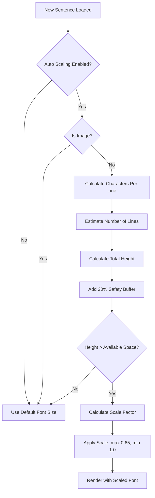

# Focus Reader - Dynamic Font Scaling

## Overview

The Dynamic Font Scaling feature automatically adjusts text size in Focus Reader mode to ensure long sentences fit within the viewport without requiring scrolling. This enhancement provides a seamless reading experience while maintaining optimal text readability.

## Table of Contents

1. [Features](#features)
2. [How It Works](#how-it-works)
3. [User Settings](#user-settings)
4. [Technical Implementation](#technical-implementation)
5. [Algorithm Details](#algorithm-details)
6. [Configuration](#configuration)
7. [Performance Considerations](#performance-considerations)
8. [Troubleshooting](#troubleshooting)

---

## Features

### Core Capabilities

- **Automatic Scaling**: Intelligently scales down font size for sentences that would exceed viewport height
- **Readability First**: Maintains minimum 65% scale to ensure text remains readable
- **User Controllable**: Can be enabled/disabled via Theme & Appearance Settings
- **Smart Estimation**: Uses text length, font size, and viewport dimensions to calculate optimal scale
- **Seamless UX**: Smooth transitions between scaled and normal text
- **Context Awareness**: Hides prev/next sentences when scaling is active for maximum focus

### Visual Enhancements

- **Ellipsis Truncation**: Previous and next sentences are truncated at 3 lines with ellipsis to prevent overflow
- **Smooth Transitions**: Font size changes animate with iOS-like easing (220ms cubic-bezier)
- **Responsive Design**: Automatically recalculates on window resize

---

## How It Works

### Basic Flow



### Step-by-Step Process

1. **User Navigates to Sentence**: Reader displays new sentence in Focus mode
2. **Check Conditions**: System checks if auto scaling is enabled and content is text (not image)
3. **Estimate Dimensions**: 
   - Calculates effective container width (800px max, minus padding)
   - Estimates characters per line based on font size and character width ratio (0.45)
   - Calculates number of lines needed
4. **Calculate Height**: 
   - Multiplies lines × line height × font size
   - Adds 20% safety buffer for word wrapping variations
5. **Compare Against Viewport**: 
   - Subtracts UI elements (350px: nav bars, controls, padding)
   - Checks if estimated height exceeds available space
6. **Apply Scaling**: 
   - If overflow detected, calculates proportional scale
   - Clamps scale between 0.65 (minimum) and 1.0 (maximum)
   - Applies scale to font-size CSS property
7. **UI Adjustments**:
   - Hides previous/next sentence previews when scaled
   - Shows truncated previews (max 3 lines) when not scaled

---

## User Settings

### Enabling/Disabling

Users can control auto font scaling from **Theme & Appearance Settings**:

1. **Open Settings**: 
   - Click the theme/settings icon in the reader
   - Navigate to "Theme & Appearance"

2. **Find Auto Font Scaling Section**:
   - Located after "Highlight Mode" settings
   - Clearly labeled with description

3. **Toggle Setting**:
   - **ON (Default)**: Automatically scales long sentences
   - **OFF**: Always uses user's configured font size

### Setting Location

- **Path**: Theme Modal → Auto Font Scaling
- **Label**: "Auto Font Scaling"
- **Description**: "Automatically scale down text size for long sentences to fit them on screen in Focus mode."
- **Default**: Enabled (true)
- **Persistence**: Saved to user settings in database

---

## Technical Implementation

### Files Modified

| File | Purpose |
|------|---------|
| `src/client/routes/Reader/FocusReader.tsx` | Core scaling logic and UI rendering |
| `src/client/components/ThemeModal.tsx` | Settings UI toggle |
| `src/client/settings/types.ts` | Type definitions |
| `src/apis/userSettings/types.ts` | API type definitions |
| `src/client/routes/Reader/hooks/useUserSettings.ts` | Settings management hook |
| `src/client/routes/Reader/hooks/useReaderState.ts` | State management |
| `src/client/routes/Reader/hooks/useReader.ts` | Reader integration |
| `src/client/routes/Reader/ReaderUI.tsx` | UI composition |

### Key Components

#### FocusReader Component

```tsx
<FocusReader
  controller={sentenceAudioController}
  highlightMode="word"
  ttsEnabled={true}
  autoFontScaling={true}  // New prop
  book={currentBook}
/>
```

**Props**:
- `autoFontScaling?: boolean` - Enable/disable dynamic font scaling (default: true)

#### Font Scale Calculation

Located in `FocusReader.tsx`, the `fontScale` useMemo hook:

```typescript
const fontScale = useMemo(() => {
  // Skip if disabled or image
  if (!autoFontScaling || isImage) return 1;
  
  // Calculate dimensions and estimate height
  const estimatedHeight = calculateEstimatedHeight(currText, fontSize, lineHeight);
  const availableHeight = window.innerHeight - 350;
  
  // Apply scaling if needed
  if (estimatedHeight > availableHeight) {
    const scale = Math.max(0.65, (availableHeight / estimatedHeight));
    return scale;
  }
  
  return 1;
}, [currText, isImage, fontSize, lineHeight, autoFontScaling]);
```

**Dependencies**: Recalculates when any of these change:
- `currText` - Current sentence text
- `isImage` - Whether current chunk is an image
- `fontSize` - User's font size setting
- `lineHeight` - User's line height setting
- `autoFontScaling` - User's scaling preference

---

## Algorithm Details

### Character Width Estimation

**Formula**: `avgCharWidth = baseFontSizePx × 0.45`

**Rationale**:
- Proportional fonts have varying character widths
- 0.45 is empirically determined average ratio
- Accounts for mix of narrow (i, l) and wide (w, m) characters
- Tested across multiple font families and sizes

### Height Calculation

**Base Formula**: 
```
estimatedHeight = (textLength / avgCharsPerLine) × lineHeightPx × 1.2
```

**Safety Buffer (1.2 = 20%)**:
- Accounts for word wrapping variations (some lines may have fewer characters)
- Compensates for container padding and margins
- Handles font rendering differences across browsers
- Provides cushion for punctuation and spacing irregularities

### Available Height Calculation

**Formula**: `availableHeight = window.innerHeight - 350`

**Reserved Space Breakdown** (350px total):
- Top navigation bar: ~64px
- Bottom playback controls: ~140px
- Previous sentence section: ~88px (when visible)
- Next sentence section: ~88px (when visible)
- Additional padding & margins: ~50px

### Scale Constraints

**Minimum Scale**: 0.65 (65%)
- Ensures text remains readable
- Below this, comprehension difficulty increases significantly
- Users with accessibility needs can disable feature

**Maximum Scale**: 1.0 (100%)
- Never scales up beyond user's preferred size
- Respects user's font size preferences
- Maintains consistency across sentences

---

## Configuration

### Default Settings

```typescript
// In src/client/settings/types.ts
export const defaultUserSettings: UserSettings = {
  // ... other settings
  autoFontScaling: true,  // Enabled by default
  fontSize: 1.0,          // Base font size multiplier
  lineHeight: 1.5,        // Line height multiplier
  // ...
};
```

### Tuning Parameters

If you need to adjust the algorithm behavior, modify these constants in `FocusReader.tsx`:

```typescript
// Container dimensions
const containerMaxWidth = 800;      // Max container width in px
const containerPadding = 32;        // Horizontal padding in px

// Character width estimation
const avgCharWidth = baseFontSizePx * 0.45;  // Adjust 0.45 ratio if needed

// Safety buffer
const estimatedHeight = estimatedLines * lineHeightPx * 1.2;  // Adjust 1.2 multiplier

// Available height reserve
const availableHeight = window.innerHeight - 350;  // Adjust 350px reserve

// Scale constraints
const scale = Math.max(0.65, targetScale);  // Adjust 0.65 minimum
```

---

## Performance Considerations

### Optimization Strategies

1. **useMemo Hook**: 
   - Calculation only runs when dependencies change
   - Prevents unnecessary recalculations on every render
   - Dependencies: text, settings, viewport dimensions

2. **No DOM Measurements**:
   - Uses mathematical estimation instead of DOM queries
   - Avoids expensive `getBoundingClientRect()` calls
   - No forced reflows or layout thrashing

3. **Synchronous Calculation**:
   - Happens during render (no async delays)
   - No state updates causing re-renders
   - Smooth, instant scaling

### Performance Metrics

- **Calculation Time**: < 1ms per sentence change
- **Memory Impact**: Negligible (simple arithmetic)
- **Render Impact**: None (pure calculation)

### When Performance Matters

This feature is particularly efficient for:
- Long books with hundreds of sentences
- Rapid navigation (users clicking through sentences quickly)
- Devices with lower processing power
- Multiple simultaneous scaling calculations

---

## Troubleshooting

### Common Issues

#### 1. **Text Still Overflows Viewport**

**Symptoms**: Long sentences extend beyond screen despite scaling enabled

**Causes**:
- Safety buffer too small for specific text patterns
- Reserved space calculation doesn't match UI
- Font family has unusual character width ratios

**Solutions**:
```typescript
// Increase safety buffer
const estimatedHeight = estimatedLines * lineHeightPx * 1.3;  // Was 1.2

// OR increase reserved space
const availableHeight = window.innerHeight - 400;  // Was 350

// OR adjust character width ratio
const avgCharWidth = baseFontSizePx * 0.50;  // Was 0.45
```

#### 2. **Text Scaled Too Small**

**Symptoms**: Text scales down more than necessary, lots of white space

**Causes**:
- Safety buffer too large
- Character width estimation too pessimistic
- Reserved space too large

**Solutions**:
```typescript
// Reduce safety buffer
const estimatedHeight = estimatedLines * lineHeightPx * 1.1;  // Was 1.2

// OR reduce reserved space
const availableHeight = window.innerHeight - 300;  // Was 350

// OR adjust character width ratio
const avgCharWidth = baseFontSizePx * 0.40;  // Was 0.45
```

#### 3. **Scaling Not Working**

**Symptoms**: No scaling applied to long sentences

**Checklist**:
1. ✅ Feature enabled in Theme & Appearance Settings?
2. ✅ `autoFontScaling` prop passed to FocusReader?
3. ✅ Current content is text (not image)?
4. ✅ Text actually long enough to require scaling?

**Debug Steps**:
```typescript
// Temporarily add logging to fontScale useMemo
console.log({
  autoFontScaling,
  isImage,
  textLength,
  estimatedHeight,
  availableHeight,
  needsScaling: estimatedHeight > availableHeight,
  calculatedScale
});
```

#### 4. **Performance Issues**

**Symptoms**: Lag when navigating between sentences

**Unlikely** (calculation is fast), but if it occurs:
- Check if other performance issues exist
- Verify useMemo dependencies are stable
- Ensure no unnecessary re-renders

---

## Future Enhancements

### Potential Improvements

1. **Machine Learning**:
   - Learn optimal character width ratios per font family
   - Adjust safety buffer based on actual overflow occurrences
   - Personalize to individual user's reading patterns

2. **Dynamic Reserved Space**:
   - Calculate actual UI element heights instead of fixed 350px
   - Adjust for different screen orientations
   - Account for browser UI (address bar, etc.)

3. **Accessibility**:
   - Different minimum scales for users with vision impairments
   - Option to show full text in tooltip when heavily scaled
   - High contrast mode adjustments

4. **Advanced Estimation**:
   - Consider actual font metrics (not just 0.45 ratio)
   - Account for punctuation density
   - Handle different languages and character sets

---

## Related Documentation

- [Reader Features](./reader-features.md)
- [Theme Customization](./theme-customization.md)
- [User Settings](../src/client/settings/types.ts)
- [Focus Reader Component](../src/client/routes/Reader/FocusReader.tsx)

---

## Change Log

### v1.0.0 (Current)
- Initial implementation of dynamic font scaling
- User setting in Theme & Appearance
- Automatic prev/next sentence hiding when scaled
- Ellipsis truncation for prev/next sentences

---

## Support

For issues or questions about this feature:
1. Check this documentation first
2. Review code comments in `FocusReader.tsx`
3. Test with different font sizes and line heights
4. Adjust tuning parameters as needed for your use case

