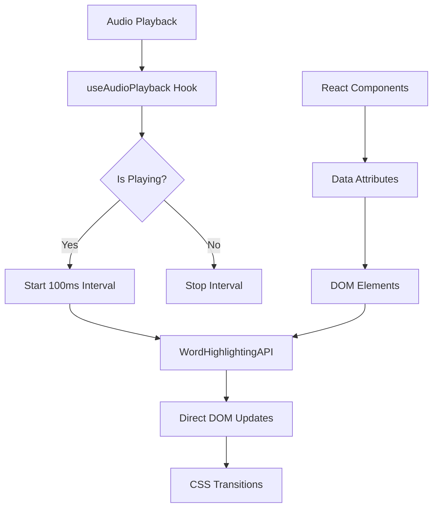

# Highlighting Systems Documentation

## Overview

This document describes both highlighting systems used in the application:
1. **Word Highlighting**: DOM-based system for real-time word highlighting during audio playback
2. **Sentence Highlighting**: React-based system for current sentence highlighting

Both systems are user-configurable through the theme panel and designed for optimal performance and user experience.

## Table of Contents

1. [Word Highlighting System](#word-highlighting-system)
   - [Architecture Overview](#word-architecture-overview)
   - [WordHighlightingAPI](#wordhighlightingapi)
   - [CSS Implementation](#word-css-implementation)
   - [Performance Optimizations](#word-performance-optimizations)
2. [Sentence Highlighting System](#sentence-highlighting-system)
   - [Architecture Overview](#sentence-architecture-overview)
   - [React Implementation](#sentence-react-implementation)
   - [CSS Implementation](#sentence-css-implementation)
3. [Theme Panel Integration](#theme-panel-integration)
   - [User Configuration Flow](#user-configuration-flow)
   - [Color Management](#color-management)
4. [Integration Points](#integration-points)
5. [Migration from Legacy System](#migration-from-legacy-system)
6. [Usage Examples](#usage-examples)
7. [Troubleshooting](#troubleshooting)

# Word Highlighting System

## Word Architecture Overview

### Design Principles

The word highlighting system follows these core principles:

- **DOM-First**: Direct DOM manipulation instead of React state updates
- **Performance-Optimized**: Minimal CPU usage with intelligent interval control
- **Decoupled**: Independent of React rendering for highlighting updates
- **Simple**: Single CSS class with smooth transitions
- **Accessible**: Maintains semantic HTML structure
- **User-Configurable**: Colors configurable through theme panel

### System Flow



## Core Components

### 1. WordHighlightingAPI

Central API for all highlighting operations:

```typescript
const WordHighlightingAPI = {
    // Color management
    setHighlightColor: (color: string) => void,
    
    // Word highlighting
    highlightWord: (chunkIndex: number, wordIndex: number) => void,
    unhighlightWord: (chunkIndex: number, wordIndex: number) => void,
    
    // Utility functions
    clearAllHighlights: () => void,
    highlightSentence: (chunkIndex: number, startWordIndex: number, endWordIndex: number) => void,
    wordExists: (chunkIndex: number, wordIndex: number) => boolean
};
```

### 2. Data Attributes System

Each word element includes targeting attributes:

```html
<span 
    data-chunk-index="0"
    data-word-index="5" 
    data-word-id="chunk-0-word-5"
    style="cursor: pointer;"
>
    word
</span>
```

### 3. Interval-Based Updates

Performance-optimized highlighting loop:

```typescript
useEffect(() => {
    if (state.isPlaying) {
        highlightIntervalRef.current = setInterval(() => {
            // Check for position changes
            if (previousHighlightRef.current?.chunkIndex !== currentChunk ||
                previousHighlightRef.current?.wordIndex !== currentWord) {
                
                // Update highlighting
                WordHighlightingAPI.unhighlightWord(/* previous */);
                WordHighlightingAPI.highlightWord(/* current */);
            }
        }, 100); // 100ms intervals
    }
    
    return () => clearInterval(highlightIntervalRef.current);
}, [state.isPlaying, state.currentChunkIndex, state.currentWordIndex]);
```

## WordHighlightingAPI

### setHighlightColor(color: string)

Sets the global highlight color using CSS custom properties.

```typescript
WordHighlightingAPI.setHighlightColor('#ffeb3b');
// Sets --highlight-color CSS variable globally
```

### highlightWord(chunkIndex: number, wordIndex: number)

Adds highlighting to a specific word element.

```typescript
WordHighlightingAPI.highlightWord(0, 5);
// Adds 'highlight-word' class to chunk-0-word-5
```

**Implementation:**
```typescript
highlightWord: (chunkIndex: number, wordIndex: number) => {
    const wordElement = document.querySelector(`[data-word-id="chunk-${chunkIndex}-word-${wordIndex}"]`);
    if (wordElement) {
        wordElement.classList.add('highlight-word');
    }
}
```

### unhighlightWord(chunkIndex: number, wordIndex: number)

Removes highlighting from a specific word element.

```typescript
WordHighlightingAPI.unhighlightWord(0, 4);
// Removes 'highlight-word' class from chunk-0-word-4
```

### clearAllHighlights()

Removes highlighting from all words on the page.

```typescript
WordHighlightingAPI.clearAllHighlights();
// Removes 'highlight-word' class from all elements
```

### highlightSentence(chunkIndex, startWordIndex, endWordIndex)

Highlights a range of words (used for sentence highlighting).

```typescript
WordHighlightingAPI.highlightSentence(0, 10, 25);
// Highlights words 10-25 in chunk 0
```

### wordExists(chunkIndex: number, wordIndex: number): boolean

Checks if a word element exists in the DOM before highlighting.

```typescript
if (WordHighlightingAPI.wordExists(0, 5)) {
    WordHighlightingAPI.highlightWord(0, 5);
}
```

## CSS Implementation

### Highlight Class

Simple, performant CSS rule with smooth transitions:

```css
.highlight-word {
    background-color: var(--highlight-color, #fff3e0);
    color: inherit;
    border-radius: 3px;
    padding: 1px 2px;
    box-shadow: 0 1px 2px rgba(0, 0, 0, 0.1);
    transition: all 0.2s ease;
}
```

### CSS Custom Properties

Dynamic color management through CSS variables:

```css
:root {
    --highlight-color: #fff3e0; /* Default highlight color */
}

/* Color can be changed dynamically */
document.documentElement.style.setProperty('--highlight-color', '#ffeb3b');
```

### Performance Benefits

- **GPU Acceleration**: CSS transitions use hardware acceleration
- **Minimal Reflow**: Only background color and padding changes
- **Smooth Animation**: 0.2s ease transition prevents jarring updates
- **Low CPU Usage**: No JavaScript animation loops

## Performance Optimizations

### 1. Interval Control

- **Smart Start/Stop**: Interval only runs when audio is playing
- **100ms Updates**: Optimal balance between responsiveness and CPU usage
- **Change Detection**: Only updates DOM when word position changes

```typescript
// Only start highlighting when playing
if (state.isPlaying) {
    setInterval(() => {
        // Only update if position changed
        if (hasPositionChanged()) {
            updateHighlighting();
        }
    }, 100);
}
```

### 2. DOM Efficiency

- **Targeted Queries**: Precise CSS selectors avoid broad DOM searches
- **Existence Checks**: Verify elements exist before manipulation
- **Minimal Operations**: Single class add/remove per update

```typescript
// Efficient targeting
const selector = `[data-word-id="chunk-${chunkIndex}-word-${wordIndex}"]`;
const element = document.querySelector(selector);
```

### 3. Memory Management

- **Ref-Based Tracking**: Use React refs to persist state without re-renders
- **Cleanup on Unmount**: Proper interval cleanup prevents memory leaks
- **Efficient Comparisons**: Object reference comparisons for change detection

```typescript
const previousHighlightRef = useRef<{chunkIndex: number; wordIndex: number} | null>(null);

// Cleanup on unmount
useEffect(() => {
    return () => {
        if (highlightIntervalRef.current) {
            clearInterval(highlightIntervalRef.current);
        }
        WordHighlightingAPI.clearAllHighlights();
    };
}, []);
```

## Integration Points

### 1. EnhancedText Component

Renders words with necessary data attributes:

```typescript
<span
    data-chunk-index={chunkIndex}
    data-word-index={wordIndex}
    data-word-id={`chunk-${chunkIndex}-word-${wordIndex}`}
    style={{ cursor: 'pointer' }}
>
    {word}
</span>
```

### 2. useAudioPlayback Hook

Manages the highlighting lifecycle:

```typescript
export const useAudioPlayback = () => {
    // WordHighlightingAPI initialization
    // Interval management
    // Color updates
    // Cleanup handlers
    
    return {
        // Audio controls
        // Sentence highlighting (still React-based)
        // No word highlighting functions (DOM-based now)
    };
};
```

### 3. Audio State Integration

Highlighting responds to audio playback state:

```typescript
// Highlights track current audio position
currentChunkIndex: state.currentChunkIndex,
currentWordIndex: state.currentWordIndex,
isPlaying: state.isPlaying
```

## Migration from Legacy System

### What Was Removed

1. **React-Based Word Highlighting**:
   - `getWordStyle()` functions
   - `getWordClassName()` functions
   - Complex CSS generation and injection
   - React state-driven updates

2. **Strategy Pattern Files**:
   - `WordHighlightingStrategy.ts`
   - `SentenceHighlightingStrategy.ts`
   - `highlighting/index.ts`
   - `highlighting/types.ts`
   - `useHighlighting.ts` hook

3. **Performance Optimizations**:
   - Legacy chunk mapping optimizations
   - React-based word prop threading
   - Complex animation CSS generation

### Migration Benefits

| Aspect | Legacy System | New DOM System |
|--------|---------------|----------------|
| **Performance** | React re-renders for each word | Direct DOM updates, no re-renders |
| **CPU Usage** | High (continuous React updates) | Low (smart interval control) |
| **Complexity** | 200+ lines across multiple files | Single API, minimal code |
| **Maintainability** | Multiple systems, prop threading | One system, direct manipulation |
| **Bundle Size** | Larger (multiple strategies) | Smaller (single implementation) |

### Compatibility

- **Sentence Highlighting**: Still uses React-based system (unchanged)
- **Audio Controls**: All audio functionality preserved
- **User Experience**: Identical visual behavior
- **Existing Books**: No changes required

## Usage Examples

### Basic Word Highlighting

```typescript
// Highlight a specific word
WordHighlightingAPI.highlightWord(0, 5);

// Change highlight color
WordHighlightingAPI.setHighlightColor('#4caf50');

// Remove highlighting
WordHighlightingAPI.unhighlightWord(0, 5);
```

### Integration in Components

```typescript
const MyComponent = () => {
    useEffect(() => {
        // Set initial highlight color
        WordHighlightingAPI.setHighlightColor('#fff3e0');
        
        // Cleanup on unmount
        return () => {
            WordHighlightingAPI.clearAllHighlights();
        };
    }, []);
    
    return (
        <span 
            data-chunk-index={0}
            data-word-index={5}
            data-word-id="chunk-0-word-5"
        >
            word
        </span>
    );
};
```

### Custom Highlighting Logic

```typescript
const highlightSequence = async (words: Array<{chunk: number, word: number}>) => {
    for (const {chunk, word} of words) {
        if (WordHighlightingAPI.wordExists(chunk, word)) {
            WordHighlightingAPI.highlightWord(chunk, word);
            await new Promise(resolve => setTimeout(resolve, 500));
            WordHighlightingAPI.unhighlightWord(chunk, word);
        }
    }
};
```

## Troubleshooting

### Common Issues

1. **Words Not Highlighting**
   - Check if `data-word-id` attributes are present
   - Verify WordHighlightingAPI is called with correct indices
   - Ensure elements exist in DOM when highlighting

2. **Performance Issues**
   - Confirm interval only runs when `isPlaying` is true
   - Check for memory leaks (intervals not cleared)
   - Verify efficient DOM queries

3. **Styling Issues**
   - Check CSS custom property `--highlight-color` is set
   - Verify `.highlight-word` class is not overridden
   - Ensure transitions are working correctly

### Debug Tools

```typescript
// Check if word exists
console.log(WordHighlightingAPI.wordExists(0, 5));

// Verify element selection
const element = document.querySelector('[data-word-id="chunk-0-word-5"]');
console.log(element);

// Check current highlight color
const color = getComputedStyle(document.documentElement)
    .getPropertyValue('--highlight-color');
console.log('Current highlight color:', color);
```

### Performance Monitoring

```typescript
// Monitor highlighting updates
let updateCount = 0;
const originalHighlight = WordHighlightingAPI.highlightWord;
WordHighlightingAPI.highlightWord = (chunk, word) => {
    updateCount++;
    console.log(`Highlight update #${updateCount}: chunk=${chunk}, word=${word}`);
    originalHighlight(chunk, word);
};
```

## Future Enhancements

### Potential Improvements

1. **Batch Operations**: Highlight multiple words in single DOM operation
2. **Intersection Observer**: Only highlight visible words for better performance
3. **Web Workers**: Move highlighting logic to background thread
4. **CSS Animations**: Replace transitions with keyframe animations for complex effects

### API Extensions

```typescript
// Future API additions
WordHighlightingAPI.highlightWords(words: Array<{chunk: number, word: number}>);
WordHighlightingAPI.setHighlightStyle(style: Partial<CSSStyleDeclaration>);
WordHighlightingAPI.onHighlightChange(callback: (chunk: number, word: number) => void);
```

---

*This document reflects the current state of the word highlighting system as of the latest refactoring. For questions or improvements, refer to the implementation in `src/client/routes/Reader/hooks/useAudioPlayback.ts`.*