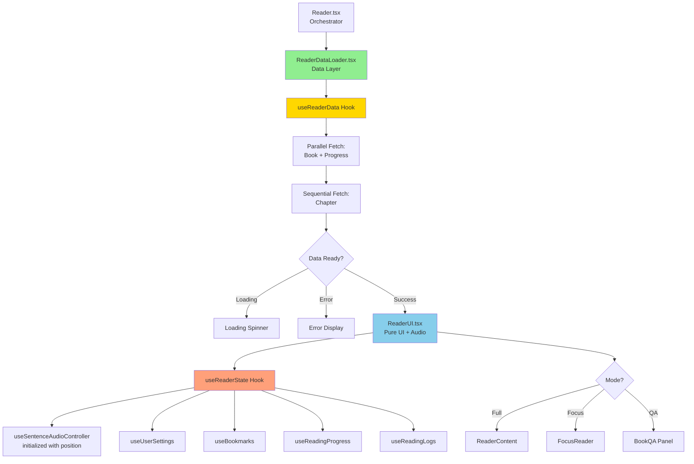
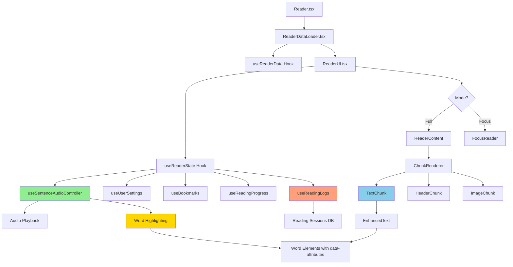
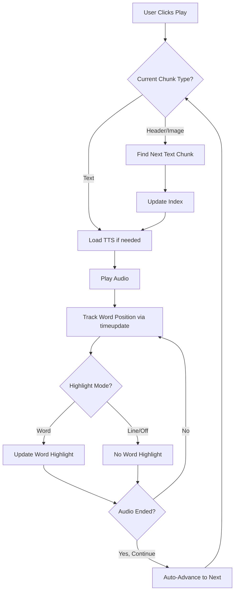
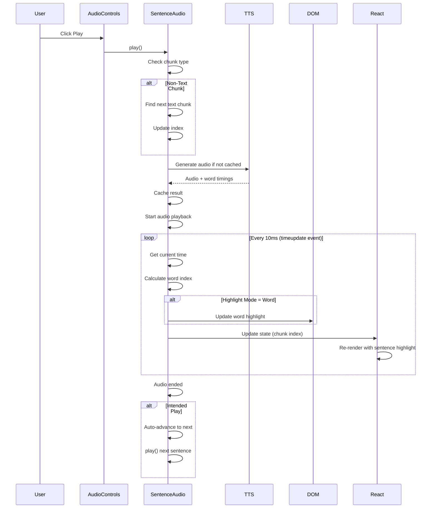
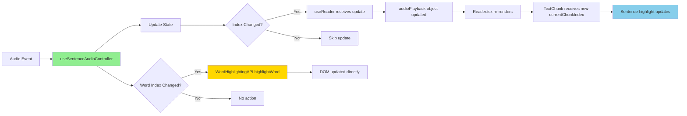

# Reader Architecture Documentation

## Overview

The Reader is a sentence-based audio book player with real-time highlighting, supporting both **Full Mode** (shows entire chapter with scrolling) and **Focus Mode** (shows one sentence at a time). The implementation uses a simplified one-to-one index mapping where **sentence indices equal chunk indices**, eliminating the need for complex index translation.

## Table of Contents

1. [Core Principles](#core-principles)
2. [Architecture Overview](#architecture-overview)
3. [Simplified Index System](#simplified-index-system)
4. [Audio Playback System](#audio-playback-system)
5. [Highlighting Systems](#highlighting-systems)
6. [Component Structure](#component-structure)
7. [Data Flow](#data-flow)
8. [Key Features](#key-features)
9. [Usage Examples](#usage-examples)
10. [Performance Optimizations](#performance-optimizations)
11. [Troubleshooting](#troubleshooting)
12. [Migration from Old System](#migration-from-old-system)

## Core Principles

### 1. Sentence Index = Chunk Index
The most important architectural decision: sentence indices directly correspond to chunk indices in the chapter. No filtering, no mapping, no translation.

```typescript
// ✅ SIMPLIFIED (Current Implementation)
const sentences = chapter?.content?.chunks || [];  // ALL chunks
const currentChunkIndex = sentenceAudio.currentSentenceIndex;  // Direct match!

// ❌ OLD (Complex Implementation)
const sentences = chunks.filter(c => c.type === 'text');  // Filtered array
const currentChunkIndex = sentenceToChunkIndex(sentenceIndex);  // Mapping required
```

### 2. Headers and Text Are Playable
Headers and text chunks both generate TTS audio and can be played. Only images are skipped.

```typescript
// ✅ Playable chunks
if (chunk.type === 'text' || chunk.type === 'header') {
    // Generate TTS and play
    await generateTts({ text: chunk.text, ... });
}

// ❌ Skip only images
if (chunk.type === 'image' || !chunk.text?.trim()) {
    // Auto-advance to next playable chunk
    return;
}
```

### 3. Unified Audio Controller
Both Full and Focus modes use the same `useSentenceAudioController` hook with the same index system.

### 4. DOM-Based Word Highlighting
Word-level highlighting uses direct DOM manipulation for performance, while sentence-level highlighting uses React's declarative rendering.

## Architecture Overview

### Data Loader Pattern (v3.0)

The Reader uses a **data loader pattern** that separates data fetching from UI rendering, eliminating race conditions and ensuring the audio controller starts at the correct position.



**Key Components:**

1. **Reader.tsx** - Simple orchestrator that renders `ReaderDataLoader`
2. **ReaderDataLoader.tsx** - Manages loading states and delegates to `ReaderUI`
3. **useReaderData.ts** - Fetches all initial data (book, chapter, reading progress) in parallel
4. **ReaderUI.tsx** - Pure UI component that receives pre-loaded data as props
5. **useReaderState.ts** - Manages runtime state (navigation, audio, settings) with pre-loaded data

**Benefits:**

- ✅ No race conditions - Data loads before UI renders
- ✅ Audio controller initialized with correct position immediately
- ✅ Faster initial load - Parallel fetching of book + progress
- ✅ Cleaner separation - Data layer vs UI layer
- ✅ Easier testing - Can test data loading and UI independently
- ✅ No complex sync effects - Single direction data flow

**Data Flow:**

```typescript
// 1. Data Loader fetches everything
useReaderData() → { book, chapter, currentChapterNumber, currentChunkIndex }

// 2. ReaderUI receives loaded data
<ReaderUI 
  initialBook={book}
  initialChapter={chapter}
  initialChapterNumber={chapterNumber}
  initialChunkIndex={chunkIndex}  // ← Position already determined
/>

// 3. Audio controller starts at correct position
useSentenceAudioController(
  chapter,
  voice,
  provider,
  speed,
  ttsEnabled,
  initialChunkIndex,  // ← No sync needed!
  ...
)
```

### Legacy Architecture (Deprecated)

The old `useReader` hook combined data fetching and runtime state, leading to complex sync effects. It has been split into `useReaderData` and `useReaderState` for better separation of concerns.

### Component Hierarchy



## Simplified Index System

### How It Works

**Chapter Structure:**
```typescript
chapter.content.chunks = [
    { index: 0, type: 'header', text: 'Chapter Title' },
    { index: 1, type: 'text', text: 'First paragraph...' },
    { index: 2, type: 'text', text: 'Second paragraph...' },
    { index: 3, type: 'image', imageName: 'figure1.jpg' },
    { index: 4, type: 'text', text: 'Third paragraph...' },
    // ...
]
```

**Sentence Array (No Filtering!):**
```typescript
// useSentenceAudioController.ts
const sentences = chapter?.content?.chunks || [];  // ALL chunks!

// Sentence index 0 = Chunk index 0 (header)
// Sentence index 1 = Chunk index 1 (text)
// Sentence index 2 = Chunk index 2 (text)
// Sentence index 3 = Chunk index 3 (image)
// Sentence index 4 = Chunk index 4 (text)
```

**Benefits:**
- ✅ No mapping function needed
- ✅ Direct array access: `sentences[chunkIndex]`
- ✅ Simple debugging: indices match everywhere
- ✅ Cleaner code: 40+ lines removed

### How Different Chunk Types Are Handled

**TTS Generation:**
```typescript
const loadSentence = async (index: number) => {
    const chunk = sentences[index];
    
    // Skip only images - generate TTS for both text and headers
    if (chunk.type === 'image' || !chunk.text?.trim()) {
        return;  // No TTS generated
    }
    
    // Generate TTS for text and header chunks
    await generateTts({ text: chunk.text, ... });
};
```

**Playback:**
```typescript
const play = async () => {
    const chunk = sentences[currentSentenceIndex];
    
    // Auto-advance past images only
    if (chunk.type === 'image' || !chunk.text?.trim()) {
        const nextPlayableIndex = sentences.findIndex(
            (c, i) => i > currentSentenceIndex && 
            (c.type === 'text' || c.type === 'header') && 
            c.text?.trim()
        );
        if (nextPlayableIndex !== -1) {
            goToSentence(nextPlayableIndex);
            setTimeout(() => play(), 50);
        }
        return;
    }
    
    // Play text or header chunk normally
    await loadSentence(currentSentenceIndex);
    // ...
};
```

**Navigation:**
```typescript
/**
 * Core navigation helper that handles audio state transitions consistently.
 * Stops current audio, navigates to new index, and resumes playback if needed.
 */
const navigateToSentenceIndex = (newIndex: number) => {
    const { intendedPlay } = stateRef.current;
    const clamped = Math.max(0, Math.min(sentences.length - 1, newIndex));

    // Stop current audio if playing
    const audio = audioRef.current;
    if (audio) {
        audio.pause();
        update({ isPlaying: false });
    }

    // Update to new sentence
    const newState = { currentSentenceIndex: clamped, currentWordIndex: 0 };
    update(newState);

    // CRITICAL: Update stateRef immediately so play() sees the new index
    stateRef.current = { ...stateRef.current, ...newState };

    // If audio was playing, start playing the new chunk
    if (intendedPlay) {
        setTimeout(() => void play(), 50);
    }
};

const goToSentence = (index: number) => {
    navigateToSentenceIndex(index);
};

const nextSentence = () => {
    const { currentSentenceIndex } = stateRef.current;
    // Find next playable chunk (text or header)
    const nextPlayableIndex = sentences.findIndex(
        (c, i) => i > currentSentenceIndex && 
        (c.type === 'text' || c.type === 'header') && 
        c.text?.trim()
    );
    if (nextPlayableIndex !== -1) {
        navigateToSentenceIndex(nextPlayableIndex);
    }
};

const prevSentence = () => {
    const { currentSentenceIndex } = stateRef.current;
    // Find previous playable chunk (text or header)
    let foundIndex = -1;
    for (let i = currentSentenceIndex - 1; i >= 0; i--) {
        const chunk = sentences[i];
        if (chunk && (chunk.type === 'text' || chunk.type === 'header') && chunk.text?.trim()) {
            foundIndex = i;
            break;
        }
    }
    
    if (foundIndex !== -1) {
        navigateToSentenceIndex(foundIndex);
    }
};
```

## Audio Playback System

### useSentenceAudioController Hook

The central hook managing all audio playback:

```typescript
export function useSentenceAudioController(
    chapter: ChapterClient | null,
    selectedVoice: string,
    selectedProvider: TtsProvider,
    playbackSpeed: number,
    ttsEnabled: boolean,
    initialSentenceIndex: number | null,
    initialWordIndex: number | null,
    highlightMode: 'word' | 'line' | 'off',
    wordTimingOffset: number = 0
): SentenceAudioApi
```

**Key Features:**
- Manages audio state (playing, current index, loading state)
- Generates TTS on-demand with caching
- Applies word timing offset for highlight synchronization
- Tracks word timing for word-level highlighting
- Handles auto-advance at sentence end
- Pre-loads adjacent sentences with priority loading
- Provides visual feedback when loading current sentence

### Audio State

```typescript
interface SentenceAudioState {
    currentSentenceIndex: number;       // Current chunk index (sentence index = chunk index!)
    currentWordIndex: number;           // Current word within sentence
    isPlaying: boolean;                 // Playback state
    intendedPlay: boolean;              // User wants continuous play
    isCurrentSentenceLoading: boolean;  // Loading state for current sentence only
    ttsError: string | null;            // Error message
    ttsServiceAvailable: boolean;       // TTS service status
}

interface SentenceAudioApi {
    sentences: TextChunkClient[];
    currentSentenceIndex: number;
    currentWordIndex: number;
    isPlaying: boolean;
    isCurrentSentenceLoading: boolean;  // Exposed for UI loading indicators
    play: () => void;
    pause: () => void;
    nextSentence: () => void;
    prevSentence: () => void;
    goToSentence: (index: number) => void;
    handleWordClick: (sentenceIndex: number, wordIndex: number) => void;
    preload: (sentenceIndex: number) => void | Promise<void>;
    retryFailed: (sentenceIndex: number) => void;
    ttsError: string | null;
    ttsServiceAvailable: boolean;
}
```

### TTS Generation & Caching

```typescript
// Cache structure: { [chunkIndex]: { src: string, timepoints: Array } }
const cacheRef = useRef<Record<number, {
    src: string;
    timepoints: Array<{ time: number; wordIndex: number }>;
}>>({});

const loadSentence = async (index: number, isCurrentSentence: boolean = false) => {
    // Check if already cached
    if (cacheRef.current[index]) {
        // Clear loading state if this is current sentence
        if (isCurrentSentence) {
            update({ isCurrentSentenceLoading: false });
        }
        return;
    }
    
    // Skip non-playable chunks
    if (chunk.type === 'image' || !chunk.text?.trim()) return;
    
    // Mark as loading if this is the current sentence
    if (isCurrentSentence) {
        update({ isCurrentSentenceLoading: true });
    }
    
    try {
        // Generate TTS with word timing
        const result = await generateTts({
            text: chunk.text,
            provider: selectedProvider,
            voiceId: selectedVoice
        });
        
        // Cache audio + word timings
        cacheRef.current[index] = {
            src: `data:audio/mp3;base64,${result.audioContent}`,
            timepoints: result.timepoints.map((tp, i) => ({
                time: tp.timeSeconds,
                wordIndex: i
            }))
        };
    } finally {
        // Clear loading state if this was the current sentence
        if (isCurrentSentence) {
            update({ isCurrentSentenceLoading: false });
        }
    }
};
```

### Playback Flow



## TTS Caching with IndexedDB

### Overview

The Reader implements **transparent TTS caching** using IndexedDB to provide instant audio playback when users return to the app. The last 10 TTS responses are cached using a FIFO (First In, First Out) eviction strategy.

### Architecture

```
useSentenceAudioController
         ↓
generateTtsWithCache() (Transparent wrapper)
         ↓
    ┌────┴────┐
    ↓         ↓
IndexedDB   TTS API
(instant)   (200-500ms)
```

**Key Files:**
- `src/client/tts/ttsCache.ts` - Transparent caching wrapper
- `src/client/offline/offlineDB.ts` - Business logic layer
- `src/client/offline/indexedDBManager.ts` - Generic database manager

### How It Works

1. **Audio Controller calls `generateTtsWithCache()`** instead of direct API
2. **Check IndexedDB cache first** (instant lookup)
3. **On cache hit**: Return audio immediately (0ms delay)
4. **On cache miss**: Call TTS API, save response to cache
5. **Auto-eviction**: When 11th entry added, oldest is automatically deleted

### Implementation Details

**Cache Key Generation:**
```typescript
const cacheKey = hash(text + voiceId + provider);
```

**Cache Record Structure:**
```typescript
interface TtsCacheRecord {
    cacheKey: string;              // hash(text + voiceId + provider)
    audioContent: string;          // base64 audio
    timepoints: TTSTimepoint[];    // word timing data
    createdAt: number;             // for FIFO ordering
}
```

**Wrapper Function (in `ttsCache.ts`):**
```typescript
export async function generateTtsWithCache(
    payload: GenerateTtsPayload
): Promise<CacheResult<GenerateTtsResponse>> {
    // 1. Try IndexedDB cache
    const cached = await offlineDB.getTtsCache(cacheKey);
    if (cached) {
        return { data: { ...cached, isFromCache: true }, isFromCache: true };
    }
    
    // 2. Call API on cache miss
    const result = await generateTts(payload);
    
    // 3. Save to cache (fire-and-forget)
    if (result.data?.success) {
        void offlineDB.putTtsCache({ cacheKey, ...result.data });
    }
    
    return result;
}
```

### Preloading and Caching

The audio controller automatically preloads the current + next 3 sentences, and **all preloaded audio is automatically cached**:

```typescript
// On initial load
loadSentence(currentIndex);      // Cached
loadSentence(currentIndex + 1);   // Cached
loadSentence(currentIndex + 2);   // Cached
loadSentence(currentIndex + 3);   // Cached

// On page refresh
loadSentence(currentIndex);       // Cache hit! (instant)
```

### Cache Management

Users can monitor and clear the cache in **Settings**:

**Stats Displayed:**
- Number of cached files (e.g., "7 of 10")
- Total cache size in MB (e.g., "0.5 MB")

**Actions:**
- "Clear Audio Cache" button
- Auto-refresh stats after clearing

**Implementation:**
```typescript
// Get cache statistics
const stats = await offlineDB.getTtsCacheStats();
console.log(`${stats.count} files, ${stats.sizeBytes} bytes`);

// Clear cache
await offlineDB.clearTtsCache();
```

### Performance Benefits

**Before Caching:**
- Every sentence load: 200-500ms API call
- 4 preloaded sentences: 800-2000ms total
- Page refresh: All sentences reload from API

**After Caching:**
- Cached sentence: 0ms (instant)
- Cache miss: 200-500ms (same as before)
- Page refresh with cache: 0ms for recent sentences ✨

**Typical User Experience:**
```
Day 1, First Visit:
  Sentence 1: 300ms (cache miss) → Cached
  Sentence 2: 250ms (cache miss) → Cached
  Sentence 3: 280ms (cache miss) → Cached
  
Day 1, Page Refresh:
  Sentence 1: 0ms (cache hit) ✨
  Sentence 2: 0ms (cache hit) ✨
  Sentence 3: 0ms (cache hit) ✨
```

### Error Handling

The caching wrapper implements **graceful degradation**:

```typescript
try {
    const cached = await offlineDB.getTtsCache(key);
    if (cached) return cached;
} catch (err) {
    console.error('Cache failed, continuing without it');
    // Falls through to API call
}
```

**Failure modes:**
- IndexedDB unavailable (private browsing): Falls back to API
- Quota exceeded: Falls back to API
- Cache read error: Falls back to API

**Audio playback never breaks** due to cache failures.

### Generic IndexedDB API

The TTS cache uses the app's **generic IndexedDB manager** for all database operations. This provides a consistent, type-safe API that can be reused for other features.

**See:** [IndexedDB API Documentation](../../../docs/indexeddb-api.md) for complete details.

**Example usage:**
```typescript
// Generic operations
await dbManager.get('tts-cache', cacheKey);
await dbManager.put('tts-cache', record);
await dbManager.getAll('tts-cache');
await dbManager.clear('tts-cache');

// Business logic wrapper
await offlineDB.getTtsCache(cacheKey);
await offlineDB.putTtsCache(record);
await offlineDB.getTtsCacheStats();
await offlineDB.clearTtsCache();
```

### Troubleshooting

**Cache not working:**
1. Check DevTools → Application → IndexedDB → `offline-reader-db`
2. Look for `tts-cache` store
3. Verify records exist with correct structure

**Cache not clearing:**
1. Check Settings UI shows correct stats
2. Try manual clear: `indexedDB.deleteDatabase('offline-reader-db')`
3. Reload page to recreate database

**Audio still slow:**
1. Check console for "TTS cache hit" messages
2. Verify cache key generation (same text/voice/provider = same key)
3. Check if cache was cleared (only last 10 entries kept)

## Highlighting Systems

### Two Independent Systems

1. **Sentence Highlighting**: React-based, highlights entire sentence with background color
2. **Word Highlighting**: DOM-based, highlights individual word during playback

Both respect the `highlightMode` setting: `'word'`, `'line'`, or `'off'`.

### Sentence Highlighting (React-Based)

Simple conditional className application:

```typescript
// TextChunk.tsx
<div
    style={{
        backgroundColor: currentChunkIndex === chunkIndex 
            ? 'var(--sentence-highlight-color, transparent)' 
            : 'transparent'
    }}
    data-chunk-index={chunkIndex}
>
    {/* Content */}
</div>
```

**How it works:**
1. `currentChunkIndex` comes from audio controller
2. Each text chunk knows its own `chunkIndex`
3. When they match → apply sentence highlight color
4. React re-renders automatically when `currentChunkIndex` changes

### Word Highlighting (DOM-Based)

Direct DOM manipulation for performance:

```typescript
// WordHighlightingAPI.ts
export const WordHighlightingAPI = {
    highlightWord: (chunkIndex: number, wordIndex: number) => {
        const element = document.querySelector(
            `[data-word-id="chunk-${chunkIndex}-word-${wordIndex}"]`
        );
        if (element) {
            element.classList.add('highlight-word');
        }
    },
    
    unhighlightWord: (chunkIndex: number, wordIndex: number) => {
        const element = document.querySelector(
            `[data-word-id="chunk-${chunkIndex}-word-${wordIndex}"]`
        );
        if (element) {
            element.classList.remove('highlight-word');
        }
    }
};
```

**Word Elements:**
```typescript
// EnhancedText.tsx
<span
    data-chunk-index={chunkIndex}
    data-word-index={wordIndex}
    data-word-id={`chunk-${chunkIndex}-word-${wordIndex}`}
>
    {word}
</span>
```

**Highlight Update:**
```typescript
// useSentenceAudioController.ts
useEffect(() => {
    if (highlightMode !== 'word') return;
    if (!state.isPlaying) return;
    
    // Remove previous highlight
    if (previous) {
        WordHighlightingAPI.unhighlightWord(
            previous.sentenceIndex,  // = chunk index!
            previous.wordIndex
        );
    }
    
    // Add new highlight (no mapping needed!)
    WordHighlightingAPI.highlightWord(
        currentSentenceIndex,  // = chunk index!
        currentWordIndex
    );
}, [state.isPlaying, state.currentSentenceIndex, state.currentWordIndex]);
```

**CSS:**
```css
.highlight-word {
    background-color: var(--word-highlight-color, transparent);
    border-radius: 3px;
    box-shadow: 0 2px 3px rgba(0, 0, 0, 0.1);
    transition: all 0.2s ease;
}
```

## Component Structure

### Reader.tsx (Main Component)

The root component that orchestrates everything:

```typescript
export const Reader = () => {
    const { settings: appSettings } = useSettings();
    const {
        book,
        chapter,
        loading,
        audio,
        settings,
        bookmarks,
        navigation,
        progress,
        sentenceAudio
    } = useReader();
    
    const isFocusMode = appSettings.readingMode === 'focus';
    
    return (
        <UserThemeProvider {...settings}>
            {/* Mode Toggle */}
            <ToggleButtonGroup value={isFocusMode ? 'focus' : 'full'}>
                <ToggleButton value="full">Full</ToggleButton>
                <ToggleButton value="focus">Focus</ToggleButton>
            </ToggleButtonGroup>
            
            {/* Content */}
            {isFocusMode ? (
                <FocusReader controller={sentenceAudio.controller} />
            ) : (
                <ReaderContent
                    chapter={chapter}
                    currentChunkIndex={audio.currentChunkIndex}
                    {...props}
                />
            )}
            
            {/* Audio Controls */}
            <AudioControls
                onPlay={sentenceAudio.controller.play}
                onPause={sentenceAudio.controller.pause}
                onNext={sentenceAudio.controller.nextSentence}
                onPrev={sentenceAudio.controller.prevSentence}
                {...controlProps}
            />
        </UserThemeProvider>
    );
};
```

### useReader Hook

Central state management hook:

```typescript
export const useReader = () => {
    // Load book and chapter data
    const [state, setState] = useState<ReaderState>({
        book: null,
        chapter: null,
        currentChapterNumber: null,
        currentChunkIndex: null,
        loading: true,
        error: null
    });
    
    // Initialize audio controller (simplified - no mapping!)
    const sentenceAudio = useSentenceAudioController(
        state.chapter,
        userSettings.selectedVoice,
        userSettings.selectedProvider,
        userSettings.playbackSpeed,
        userSettings.ttsEnabled,
        state.currentChunkIndex ?? 0,
        0,
        userSettings.highlightMode,
        userSettings.wordSpeedOffset
    );
    
    // Create audio playback adapter
    const audioPlayback = {
        currentChunkIndex: sentenceAudio.currentSentenceIndex,  // Direct!
        currentWordIndex: sentenceAudio.currentWordIndex,
        isPlaying: sentenceAudio.isPlaying,
        // ...
    };
    
    return {
        book: state.book,
        chapter: state.chapter,
        audio: audioPlayback,
        settings: userSettings,
        sentenceAudio,
        // ...
    };
};
```

### ReaderContent (Full Mode)

Renders the entire chapter with scrolling:

```typescript
export const ReaderContent = ({
    chapter,
    currentChunkIndex,
    ...props
}) => {
    // Group chunks by paragraph
    const paragraphGroups = useParagraphGrouping(chapter.content.chunks);
    
    return (
        <Box>
            <ChunkRenderer
                paragraphGroups={paragraphGroups}
                currentChunkIndex={currentChunkIndex}
                {...props}
            />
        </Box>
    );
};
```

### ChunkRenderer

Renders different chunk types:

```typescript
export const ChunkRenderer = ({
    paragraphGroups,
    currentChunkIndex,
    ...props
}) => {
    const renderChunk = (chunk: TextChunkClient) => {
        switch (chunk.type) {
            case 'header':
                return <HeaderChunk chunk={chunk} chunkIndex={chunk.index} />;
            
            case 'image':
                return <ImageChunk chunk={chunk} chunkIndex={chunk.index} />;
            
            case 'text':
            default:
                return (
                    <TextChunk
                        chunk={chunk}
                        chunkIndex={chunk.index}  // Original chunk index!
                        currentChunkIndex={currentChunkIndex}
                        {...props}
                    />
                );
        }
    };
    
    return (
        <>
            {paragraphGroups.map(group => (
                <Box key={group.paragraphIndex}>
                    {group.chunks.map(chunk => renderChunk(chunk))}
                </Box>
            ))}
        </>
    );
};
```

### TextChunk Component

Renders individual text chunk with highlighting:

```typescript
export const TextChunk = ({
    chunk,
    chunkIndex,
    currentChunkIndex,
    handleLinkClick
}) => {
    const isHighlighted = currentChunkIndex === chunkIndex;
    
    return (
        <div
            style={{
                backgroundColor: isHighlighted 
                    ? 'var(--sentence-highlight-color, transparent)' 
                    : 'transparent'
            }}
            id={`text-chunk-${chunkIndex}`}
            data-chunk-index={chunkIndex}
            data-paragraph-index={chunk.paragraphIndex}
        >
            <EnhancedText
                chunk={chunk}
                chunkIndex={chunkIndex}
                onLinkClick={handleLinkClick}
            />
        </div>
    );
};
```

### EnhancedText Component

Renders words with data attributes for highlighting:

```typescript
export const EnhancedText = ({ chunk, chunkIndex }) => {
    const renderTextWithHighlighting = (text: string) => {
        const words = text.split(/\s+/);
        return (
            <>
                {words.map((word, wordIndex) => (
                    <span
                        key={wordIndex}
                        data-chunk-index={chunkIndex}
                        data-word-index={wordIndex}
                        data-word-id={`chunk-${chunkIndex}-word-${wordIndex}`}
                    >
                        {word}
                    </span>
                ))}
            </>
        );
    };
    
    return <span>{renderTextWithHighlighting(chunk.text)}</span>;
};
```

### FocusReader (Focus Mode)

Shows one sentence at a time in large text with special header styling:

```typescript
export const FocusReader = ({ controller, highlightMode }) => {
    const currentChunk = controller.sentences[controller.currentSentenceIndex];
    const isHeader = currentChunk?.type === 'header';
    const currentWords = currentChunk?.text.split(/\s+/) || [];
    
    return (
        <Box>
            {/* Current sentence/header display */}
            <Box
                sx={{
                    ...(isHeader && {
                        mx: -2,
                        px: 2,
                        py: 3,
                        backgroundColor: '#d3d3d3',  // Light gray in light mode
                        '@media (prefers-color-scheme: dark)': {
                            backgroundColor: '#333333'  // Dark gray in dark mode
                        },
                        borderTop: '2px solid var(--color-separator)',
                        borderBottom: '2px solid var(--color-separator)'
                    })
                }}
            >
                <Typography
                    variant={isHeader ? "h2" : "h4"}
                    sx={{
                        fontSize: isHeader ? `${fontSize * 2.2}rem` : `${fontSize * 1.5}rem`,
                        fontWeight: isHeader ? 800 : 700,
                        textAlign: 'center',
                        color: textColor,  // Uses user's theme color
                        letterSpacing: isHeader ? '-0.01em' : 'normal',
                        textTransform: isHeader ? 'uppercase' : 'none'
                    }}
                >
                    {currentWords.map((word, i) => (
                        <span
                            key={i}
                            className={
                                highlightMode === 'word' && 
                                controller.isPlaying && 
                                i === controller.currentWordIndex
                                    ? 'highlight-word'
                                    : ''
                            }
                            data-word-index={i}
                        >
                            {word}{' '}
                        </span>
                    ))}
                </Typography>
            </Box>
        </Box>
    );
};
```

**Focus Mode Features:**
- ✅ **Headers rendered distinctly** - Gray background, uppercase, larger font
- ✅ **Headers play with TTS** - Both text and headers are read aloud
- ✅ **User theme colors** - Text uses customizable theme colors
- ✅ **Word highlighting** - Works for both headers and text
- ✅ **Previous/Next preview** - Shows adjacent chunks with styling

## Data Flow

### Playback Flow



### State Update Flow



## Key Features

### 1. Dual Mode Support

**Full Mode:**
- Shows entire chapter
- Scrollable content
- Sentence highlighting follows audio
- "Scroll to current" FAB when out of view
- **Fullscreen mode** - Distraction-free reading with minimal controls (text + font size buttons only)

**Focus Mode:**
- One sentence at a time
- Large, centered text
- Minimal distractions
- Previous/Next sentence preview

### 2. Real-Time Highlighting

**Word-Level (DOM-based):**
- Updates every 10ms during playback
- No React re-renders
- Smooth, performant
- Configurable color

**Sentence-Level (React-based):**
- Updates when sentence changes
- Automatic with React
- Configurable background color

### 3. Automatic Progress Tracking

- Saves current position (chapter + chunk)
- **Syncs on every sentence change** - Both modes track progress
- Tracks reading time and sessions
- Syncs with server (debounced)
- **Restores position on reload** - Always starts at saved position
- **Controlled component architecture** - State drives controller, controller tracks progress

**Implementation (v3.1 - Controlled Component):**
```typescript
// Audio controller is a "controlled component" driven by state
const sentenceAudio = useSentenceAudioController(
    state.chapter,
    userSettings.selectedVoice,
    userSettings.selectedProvider as TtsProvider,
    userSettings.playbackSpeed,
    userSettings.ttsEnabled,
    state.currentChunkIndex ?? 0,  // ← Controlled by state
    0,
    userSettings.highlightMode,
    userSettings.wordSpeedOffset
);

// Reading progress tracks controller's real-time position
const readingProgress = useReadingProgress({
    userId: user?.id || '',
    bookId,
    currentChapterNumber: state.currentChapterNumber,
    currentChunkIndex: sentenceAudio.currentSentenceIndex, // ← Real-time position
    isPlaying: audioPlayback.isPlaying,
    isInitialLoadComplete: true
});

// User navigation updates state first, controller follows
const audioPlayback = {
    handleNextChunk: () => {
        const newIndex = Math.min(sentenceAudio.sentences.length - 1, (state.currentChunkIndex ?? 0) + 1);
        setCurrentChunkIndex(newIndex); // Update state, controller follows
    },
    // ...
};
```

**Position Restoration Fix (v3.1):**
- ✅ **Data loader pattern** - All data loads before UI renders (no race conditions)
- ✅ **Lazy initialization** - Controller initializes at correct position from the start
- ✅ **Initial mount guard** - Chapter change effect skips reset on first render
- ✅ **Controlled component** - State drives controller, eliminates sync complexity
- ✅ **Real-time progress** - Tracks actual playback position, not stale state
- ✅ **Works in both modes** - Full and Focus modes restore correctly

**Bug Fixes Applied:**
1. **Reading progress not saving** - Now uses `sentenceAudio.currentSentenceIndex` (real-time position)
2. **Position reset to 0 on load** - Chapter change effect now skips reset on initial mount
3. **Race conditions eliminated** - Data loader pattern ensures correct initialization order

### 4. Reading Session Logging

The `useReadingLogs` hook automatically tracks and logs every chunk played during a reading session:

**Key Features:**
- **Automatic logging** - Logs each text/header chunk when audio plays
- **User-specific** - Uses authenticated user ID from `useAuth()`
- **Direct index mapping** - Uses `sentenceAudio.currentSentenceIndex` directly (no filtering)
- **Smart filtering** - Only logs text and header chunks, skips images
- **Session grouping** - Server groups logs into reading sessions (5-minute gaps)

**Implementation:**
```typescript
// In useReader hook
useReadingLogs({
    userId: user?.id || '',
    bookId,
    chapter: state.chapter,
    currentChunkIndex: sentenceAudio.currentSentenceIndex,  // Direct from audio controller
    isPlaying: audioPlayback.isPlaying
});

// In useReadingLogs hook
const logChunk = async (chunkIndex: number) => {
    // Get all chunks (chunkIndex refers to position in full array)
    const allChunks = chapter.content.chunks;
    const chunk = allChunks[chunkIndex];
    
    // Only log text and header chunks (skip images and empty chunks)
    if (chunk.type === 'image' || !chunk.text?.trim()) return;
    
    await createReadingLog({
        userId,
        bookId,
        chapterNumber: chapter.chapterNumber,
        chunkIndex,
        chunkText: chunk.text
    });
};
```

**Reading History:**
- View all reading sessions at `/reading-history`
- Sessions grouped by date
- Shows book, chapter, duration, and chunks read
- Click to resume from any logged position

**Important:** The hook uses the actual playing position (`sentenceAudio.currentSentenceIndex`) to avoid render cycle delays and index mismatches.

### 5. Bookmarks

- Quick-add with audio controls
- Jump to bookmarked position
- Persists across sessions
- Chapter + chunk index stored

### 6. Offline Support

**Online-First Strategy:**
- When **online**: Always fetches fresh data from network (no stale cache issues)
- When **offline**: Falls back to cached chapters (offline reading)
- Cache is only used when network is unavailable

**Implementation:**
```typescript
const loadChapterPreferOffline = useCallback(async (
    bookIdParam: string,
    chapterNumber: number
): Promise<{ chapter: ChapterClient | null; fromLocal: boolean }> => {
    // When online, always fetch fresh data from network
    if (isOnline()) {
        const chapterResult = await getChapterByNumber({ bookId: bookIdParam, chapterNumber });
        return { chapter: chapterResult.data?.chapter || null, fromLocal: false };
    }
    
    // When offline, use cached chapter
    const localRec = await offlineDB.getChapterByBookAndNumber(bookIdParam, chapterNumber);
    if (localRec) {
        return { chapter: buildChapterFromLocal(localRec), fromLocal: true };
    }
    
    // Offline but no cached chapter available
    return { chapter: null, fromLocal: false };
}, [buildChapterFromLocal]);
```

**Offline Management:**
- Download chapters for offline reading via download UI
- Clear offline data: `await window.indexedDB.deleteDatabase('offline-reader-db')`
- Better error messages distinguish between offline unavailable vs not found

**Benefits:**
- ✅ **Always fresh when online** - No stale cache issues
- ✅ **Works offline** - Can read downloaded chapters without internet
- ✅ **Correct position restoration** - No conflicts between cached and server data
- ✅ **Clear error messages** - Users know when they need internet vs cached chapter is missing

### 7. Theme Customization

- Font size (0.8x - 2.0x), family, line height
- Text color (per-mode: light/dark)
- Word highlight color (per-mode: light/dark)
- Sentence highlight color (per-mode: light/dark)
- Light/Dark theme
- **Highlight Mode** (`'word'` | `'line'` | `'off'`) - Persisted per user
- **Fullscreen Mode** - Available in Full mode for distraction-free reading

**Highlight Mode Persistence:**
```typescript
// Saved to user settings in database
interface UserSettings {
    highlightMode?: 'word' | 'line' | 'off';
    // ... other settings
}

// Updated via Theme & Appearance modal
const handleHighlightModeChange = async (mode: 'word' | 'line' | 'off') => {
    updateState({ highlightMode: mode });
    await updateUserSettings({ 
        userId, 
        settings: { highlightMode: mode } 
    });
};
```

### 8. Speed Control

- Playback speed (0.5x - 2.0x)
- Voice selection (multiple providers)
- TTS provider selection
- **Word timing offset adjustment** (-500ms to +500ms)

**Word Timing Offset:**
The word timing offset allows users to adjust when word/line highlighting occurs relative to the audio:
- **Positive offset** (e.g., +100ms): Highlights advance 100ms earlier than the audio
- **Negative offset** (e.g., -100ms): Highlights advance 100ms later than the audio
- Applied in `handleTimeUpdate` by adjusting `audio.currentTime` before comparing with timepoints
- Works for both **word** and **line** highlighting modes in Full and Focus readers
- **Reactive**: Changes apply immediately during playback without needing to restart

```typescript
// In useSentenceAudioController
useEffect(() => {
    const audio = audioRef.current;
    
    const handleTimeUpdate = () => {
        const currentTime = audio.currentTime;
        // Apply offset (convert ms to seconds)
        // Positive = highlight earlier, negative = highlight later
        const adjustedTime = currentTime + (wordTimingOffset / 1000);
        
        // Find current word based on adjusted time
        let newWordIndex = 0;
        for (let i = 0; i < timepoints.length; i++) {
            if (adjustedTime >= timepoints[i].time) {
                newWordIndex = timepoints[i].wordIndex;
            } else {
                break;
            }
        }
        // Update state triggers both word and line highlights
        setState(prev => ({ ...prev, currentWordIndex: newWordIndex }));
    };
    
    audio.addEventListener('timeupdate', handleTimeUpdate);
    return () => audio.removeEventListener('timeupdate', handleTimeUpdate);
    
    // IMPORTANT: wordTimingOffset in dependency array ensures
    // the event listener updates when offset changes
}, [wordTimingOffset, ...otherDeps]);
```

**Implementation Note:** The `wordTimingOffset` parameter must be included in the `useEffect` dependency array to ensure the event listener is recreated when the offset changes, preventing stale closure issues.

### 9. Smart Audio Navigation

**Next/Prev Button Behavior:**
- **Stops current audio** immediately
- **Navigates** to next/previous playable chunk
- **Auto-resumes playback** if audio was playing before navigation
- **Maintains state** if audio was paused

**Refactored Architecture (v2.0):**
All navigation methods (`goToSentence`, `nextSentence`, `prevSentence`) now use a shared helper function to ensure consistent behavior and eliminate code duplication.

```typescript
/**
 * Core navigation helper that handles all audio state transitions.
 * Prevents race conditions by immediately updating stateRef.
 */
const navigateToSentenceIndex = (newIndex: number) => {
    const { intendedPlay } = stateRef.current;
    
    // Stop current audio
    const audio = audioRef.current;
    if (audio) {
        audio.pause();
        update({ isPlaying: false });
    }
    
    // Update state
    const newState = { currentSentenceIndex: newIndex, currentWordIndex: 0 };
    update(newState);
    
    // CRITICAL: Update stateRef immediately to prevent race conditions
    stateRef.current = { ...stateRef.current, ...newState };
    
    // Resume if was playing
    if (intendedPlay) {
        setTimeout(() => play(), 50);
    }
};

// All navigation methods delegate to the shared helper
const goToSentence = (index: number) => navigateToSentenceIndex(index);
const nextSentence = () => {
    const nextIndex = findNextPlayableChunk();
    if (nextIndex !== -1) navigateToSentenceIndex(nextIndex);
};
const prevSentence = () => {
    const prevIndex = findPreviousPlayableChunk();
    if (prevIndex !== -1) navigateToSentenceIndex(prevIndex);
};
```

**Benefits of Refactoring:**
- ✅ **Single source of truth** - One function handles all audio transitions
- ✅ **Race condition fix** - Immediate `stateRef` update prevents stale reads
- ✅ **Consistency** - All navigation methods behave identically
- ✅ **Maintainability** - Changes to navigation logic only need to be made once
- ✅ **Reduced code** - Eliminated ~80 lines of duplicate code

## Usage Examples

### Basic Playback

```typescript
// Get audio controller from useReader
const { sentenceAudio } = useReader();

// Play current sentence
sentenceAudio.controller.play();

// Pause
sentenceAudio.controller.pause();

// Next sentence (finds next text chunk automatically)
sentenceAudio.controller.nextSentence();

// Previous sentence (finds previous text chunk)
sentenceAudio.controller.prevSentence();

// Jump to specific chunk
sentenceAudio.controller.goToSentence(42);  // Chunk index 42
```

### Highlighting Control

```typescript
// Set highlight mode
updateSettings({ highlightMode: 'word' });  // or 'line' or 'off'

// Customize colors
updateSettings({
    highlightColor: '#ffeb3b',           // Word highlight
    sentenceHighlightColor: '#e3f2fd'    // Sentence highlight
});
```

### Navigation

```typescript
// Change chapter
navigation.setCurrentChapterNumber(5);

// Jump to bookmark
navigation.handleNavigateToBookmark(chapterNumber, chunkIndex);

// Previous/Next chapter
navigation.handlePreviousChapter();
navigation.handleNextChapter();
```

## Performance Optimizations

### 1. TTS Caching
```typescript
// Cache structure prevents re-generation
const cacheRef = useRef<Record<number, { src: string; timepoints: Array }>({});

// Check cache before generating
if (cacheRef.current[index]) {
    // Use cached audio
    return;
}
```

### 2. Smart TTS Pre-fetching with Priority Loading

**TTS Toggle Handling:**
```typescript
// Detect when TTS is toggled from OFF to ON
const prevTtsEnabledRef = useRef(ttsEnabled);

useEffect(() => {
    // Reset flag when TTS is toggled on (from false to true)
    if (ttsEnabled && !prevTtsEnabledRef.current) {
        hasInitiallyLoadedRef.current = false;
    }
    prevTtsEnabledRef.current = ttsEnabled;
    
    // ... prefetching logic runs with reset flag
}, [ttsEnabled, state.currentSentenceIndex]);
```

**Priority Loading Strategy:**
```typescript
// When TTS is enabled or page loads: Priority + Background approach
if (!hasInitiallyLoadedRef.current && sentences.length > 0 && ttsEnabled) {
    // PRIORITY: Load current + next sentence first (parallel)
    const currentLoad = loadSentence(currentSentenceIndex, true);
    const nextLoad = currentSentenceIndex + 1 < sentences.length 
        ? loadSentence(currentSentenceIndex + 1) 
        : Promise.resolve();
    
    hasInitiallyLoadedRef.current = true;
    
    // BACKGROUND: After priority loads complete, prefetch +2 and +3
    void Promise.all([currentLoad, nextLoad]).then(() => {
        const furtherIndexes = [
            currentSentenceIndex + 2,
            currentSentenceIndex + 3
        ].filter(i => i >= 0 && i < sentences.length);
        furtherIndexes.forEach(i => void loadSentence(i));
    });
}
```

**Rolling Window Strategy:**
```typescript
// When moving between sentences: maintain 3-sentence lookahead
else if (hasInitiallyLoadedRef.current && ttsEnabled) {
    // Load current if not cached (with loading state)
    const isCached = !!cacheRef.current[currentSentenceIndex];
    if (!isCached) {
        void loadSentence(currentSentenceIndex, true);
    }
    
    // Prefetch +3 ahead (rolling window)
    const nextIndex = currentSentenceIndex + 3;
    if (nextIndex < sentences.length) {
        void loadSentence(nextIndex);
    }
    
    // Also prefetch previous for backward navigation
    const prevIndex = currentSentenceIndex - 1;
    if (prevIndex >= 0) {
        void loadSentence(prevIndex);
    }
}
```

**Loading State Tracking:**
```typescript
const loadSentence = async (index: number, isCurrentSentence: boolean = false) => {
    // Check if already cached
    if (cacheRef.current[index]) {
        if (isCurrentSentence) {
            update({ isCurrentSentenceLoading: false });
        }
        return;
    }
    
    // Mark as loading if this is the current sentence
    if (isCurrentSentence) {
        update({ isCurrentSentenceLoading: true });
    }
    
    try {
        // Generate TTS...
        const result = await generateTts({ text, provider, voiceId });
        cacheRef.current[index] = { src, timepoints };
    } finally {
        // Clear loading state
        if (isCurrentSentence) {
            update({ isCurrentSentenceLoading: false });
        }
    }
};
```

**Visual Loading Indicator:**
The AudioControls component displays a circular progress spinner around the play button when loading:
```typescript
// In AudioControls.tsx
{isCurrentChunkLoading && (
    <CircularProgress
        size={72}
        thickness={2}
        sx={{
            color: '#4caf50',
            position: 'absolute',
            // Centered over play button
        }}
    />
)}
```

**Benefits:**
- ⚡ **Fastest time-to-play** - current sentence loads first (priority)
- 🎯 **Smart prioritization** - most critical audio loads before others
- 🔄 **Background prefetching** - next sentences load seamlessly after
- 📊 **Loading feedback** - visual spinner shows when current sentence is loading
- ✅ **TTS toggle aware** - prefetches immediately when TTS is enabled
- 🎵 **Smooth playback** - 3-sentence buffer maintains seamless transitions
- 🔀 **Navigation ready** - uncached sentences load with visual feedback

### 3. DOM-Based Word Highlighting
```typescript
// No React re-renders for word updates
useEffect(() => {
    // Direct DOM manipulation
    WordHighlightingAPI.highlightWord(chunkIndex, wordIndex);
}, [state.currentWordIndex]);
```

### 4. Efficient Chunk Rendering
```typescript
// Only re-renders when currentChunkIndex changes
const isHighlighted = currentChunkIndex === chunkIndex;
```

### 5. Ref-Based State Tracking
```typescript
// Avoid stale closures in intervals
const stateRef = useRef(state);
useEffect(() => { stateRef.current = state; }, [state]);

// Use in async callbacks
const currentState = stateRef.current;
```

---

## Troubleshooting

### Reader Not Starting at Saved Position

**Symptom:** Reader always starts at beginning of chapter instead of last reading position (both Full and Focus modes).

**Root Causes Fixed in v3.1:**

1. **Reading Progress Not Saving**: `useReadingProgress` was tracking stale `state.currentChunkIndex` instead of real-time controller position
2. **Position Reset on Mount**: Audio controller's chapter change effect ran on initial mount, resetting position to 0
3. **Race Conditions**: Complex initialization order caused loaded position to be overwritten

**Solutions Applied:**

**Fix 1: Track Real-Time Position (in `useReaderState.ts`)**
```typescript
// Reading progress now tracks controller's actual position
const readingProgress = useReadingProgress({
    userId: user?.id || '',
    bookId,
    currentChapterNumber: state.currentChapterNumber,
    currentChunkIndex: sentenceAudio.currentSentenceIndex, // ← Real-time, not stale state
    isPlaying: audioPlayback.isPlaying,
    isInitialLoadComplete: true
});
```

**Fix 2: Prevent Reset on Initial Mount (in `useSentenceAudioController.ts`)**
```typescript
// Skip reset effect on initial mount - lazy initialization already set correct position
const isInitialMount = useRef(true);
const prevChapterNumber = useRef(chapter?.chapterNumber);

useEffect(() => {
    const currentChapterNumber = chapter?.chapterNumber;
    
    // Skip reset on initial mount
    if (isInitialMount.current) {
        isInitialMount.current = false;
        prevChapterNumber.current = currentChapterNumber;
        return; // Don't reset position
    }
    
    // Only reset when chapter actually changes (user navigation)
    if (currentChapterNumber !== prevChapterNumber.current) {
        hasInitiallyLoadedRef.current = false;
        // ... reset audio state to 0 for new chapter
        prevChapterNumber.current = currentChapterNumber;
    }
}, [chapter?.chapterNumber, update]);
```

**Fix 3: Data Loader Pattern (in `ReaderDataLoader.tsx`)**
```typescript
// Loads all data (book, chapter, progress) BEFORE rendering UI
const { data, loading, error } = useReaderData();

if (loading) return <LoadingSpinner />;
if (error) return <ErrorDisplay />;

// Only render when data is ready
return <ReaderUI 
    initialChunkIndex={data.currentChunkIndex}  // ← Already determined
    {...data}
/>;
```

**Expected Behavior:**
- ✅ Data loads with saved position (e.g., chunk 98)
- ✅ Controller initializes at chunk 98 via lazy initialization
- ✅ Chapter change effect skips reset (initial mount detected)
- ✅ Reader displays starting at chunk 98
- ✅ Reading progress saves updates as user reads
- ✅ Position persists across page refreshes
- ✅ Works in both Full and Focus modes

**If Still Not Working:**
1. Check browser console for error logs
2. Verify reading progress is being saved (Network tab → watch for `updateReadingPosition` API calls)
3. Clear browser cache and reload
4. Check that user is logged in (progress requires authentication)

---

### Focus/Full Mode Sync Issues (Fixed in v3.2)

**Symptom:** Position changes when switching between Focus and Full modes.

**Root Cause Fixed:**
- Focus mode used custom navigation handlers (`handleFocusNext`, `handleFocusPrev`) that operated independently from the audio controller
- This created two separate navigation systems that didn't stay in sync

**Solution Applied:**
```typescript
// BEFORE (Bug): Custom handlers for Focus mode
<AudioControls
    onPreviousChunk={activeTab === 'focus' ? handleFocusPrev : controller.prevSentence}
    onNextChunk={activeTab === 'focus' ? handleFocusNext : controller.nextSentence}
/>

// AFTER (Fixed): Unified navigation for all modes
<AudioControls
    onPreviousChunk={controller.prevSentence}
    onNextChunk={controller.nextSentence}
/>
```

**Result:** Both modes now share the same navigation handlers and maintain perfect sync.

---

### QA Chat Using Wrong Context (Fixed in v3.2)

**Symptom:** AI responses reference incorrect sentences or positions.

**Root Cause Fixed:**
- QA chat was using `audio.currentChunkIndex` (stale state value) instead of real-time controller position
- State was not updating as user navigated

**Solution Applied:**
```typescript
// BEFORE (Bug): Using stale state
const bookQA = useBookQA({
    currentSentence: audio.textChunks[audio.currentChunkIndex].text,
    getLastSentences: () => {
        const startIndex = audio.currentChunkIndex - contextCount;
        return audio.textChunks.slice(startIndex, audio.currentChunkIndex);
    }
});

// AFTER (Fixed): Using real-time controller position
const bookQA = useBookQA({
    currentSentence: audio.textChunks[sentenceAudio.controller.currentSentenceIndex].text,
    getLastSentences: () => {
        const startIndex = sentenceAudio.controller.currentSentenceIndex - contextCount;
        return audio.textChunks.slice(startIndex, sentenceAudio.controller.currentSentenceIndex);
    }
});
```

**Result:** QA chat now always references the actual current reading position.

---

### TTS Error Flashing on Auto-Advance (Fixed in v3.2)

**Symptom:** Error messages appear briefly then disappear when audio auto-advances to next sentence.

**Root Cause Fixed:**
- Auto-advance called `play()` which cleared all errors, even if the error was still relevant
- User never had time to see or acknowledge the error

**Solution Applied:**
```typescript
// Added userInitiated parameter to distinguish user actions from auto-advance
const play = useCallback(async (userInitiated: boolean = false) => {
    // ... load and play audio ...
    
    // Only clear errors on user-initiated play
    if (userInitiated) {
        update({ isPlaying: true, intendedPlay: true, ttsError: null });
    } else {
        update({ isPlaying: true, intendedPlay: true }); // Keep error
    }
}, [/* deps */]);

// In ReaderUI
const handleUserPlay = useCallback(() => {
    void sentenceAudio.controller.play(true); // User clicked play
}, [sentenceAudio.controller]);
```

**Result:** 
- Errors persist across auto-advance sentences
- Errors only clear when user explicitly clicks play or dismiss
- Users have time to read and acknowledge errors

---

### Audio Error Handling

**How Error Handling Works:**

The audio system implements smart error filtering and recovery:

1. **Expected Browser Errors (Filtered):**
   - "interrupted" errors when changing audio source
   - "abort" / "aborted" / "AbortError" when rapidly switching between chunks
   - "The operation was aborted" on iOS Safari (even during successful playback)
   - "NotAllowedError" for autoplay policy restrictions
   - HTMLAudioElement `MEDIA_ERR_ABORTED` (code 1) on iOS Safari
   - Empty src attribute errors during chapter transitions (cleanup phase)
   - These are logged to console.debug but NOT shown to users

2. **Preloading Errors (Silent):**
   - Background preloading errors for future sentences are tracked but not displayed
   - System continues retrying failed preloads on navigation
   - Only errors for the CURRENT sentence are shown to users

3. **Real TTS Errors (Displayed):**
   - TTS generation failures for the current sentence
   - Network errors when playing current audio
   - Service unavailability when attempting playback
   - Invalid voice/provider configuration

**Error UX Behavior:**
```typescript
// Error state includes sentence context
ttsError: { message: string; sentenceIndex: number } | null

// Only show errors for current sentence (not preloading errors)
const shouldShowError = 
    ttsError && 
    ttsError.sentenceIndex === currentSentenceIndex;

// In useSentenceAudioController.ts

// Promise-based error handling (from audio.play())
try {
    await audio.play();
    if (userInitiated) {
        // User-initiated play clears errors
        update({ isPlaying: true, intendedPlay: true, ttsError: null });
    } else {
        // Auto-advance preserves errors for visibility
        update({ isPlaying: true, intendedPlay: true });
    }
} catch (e) {
    const errorMessage = e instanceof Error ? e.message : 'Playback failed';
    
    // Filter expected browser errors (case-insensitive)
    // iOS Safari commonly throws "The operation was aborted" even when playback succeeds
    const lowerMessage = errorMessage.toLowerCase();
    const isExpectedBrowserError = 
        lowerMessage.includes('interrupted') ||
        lowerMessage.includes('abort') ||  // Catches "aborted", "AbortError", etc.
        lowerMessage.includes('notallowederror'); // Autoplay policy errors
    
    if (!isExpectedBrowserError) {
        // Track which sentence failed
        update({ ttsError: { message: errorMessage, sentenceIndex: currentSentenceIndex }, isPlaying: false });
    }
}

// Event-based error handling (from HTMLAudioElement)
audio.addEventListener('error', (event) => {
    const error = (event.target as HTMLAudioElement).error;
    
    // iOS Safari often fires MEDIA_ERR_ABORTED (code 1) even when playback succeeds
    if (error?.code === 1) { // MEDIA_ERR_ABORTED
        console.debug('iOS Safari audio error (benign):', error.message);
        return;
    }
    
    // Filter out empty src errors - these happen during chapter transitions when we cleanup
    // An empty src will trigger MEDIA_ERR_SRC_NOT_SUPPORTED which is expected during cleanup
    if (audio.src === '' || audio.src === window.location.href) {
        console.debug('Audio error during cleanup (benign):', error?.message);
        return;
    }
    
    // Only report real errors: MEDIA_ERR_NETWORK (2), MEDIA_ERR_DECODE (3), MEDIA_ERR_SRC_NOT_SUPPORTED (4)
    if (error && error.code >= 2) {
        update({ ttsError: { message: error.message, sentenceIndex: currentSentenceIndex }, isPlaying: false });
    }
});
```

**User Control During Errors:**
- ✅ **Pause button is NEVER disabled** - users can always stop playing audio
- ✅ **Play button is only disabled for real errors** - not for expected browser events
- ✅ **Errors are dismissible** - users can click X to clear error messages
- ✅ **Silent preloading** - background load failures don't interrupt playback
- ✅ **Context-aware errors** - only current sentence errors are shown

**Common Error Messages:**

| Error | Cause | User Action |
|-------|-------|-------------|
| "Audio service is currently unavailable" | TTS provider down or API key invalid | Check settings, verify provider configuration |
| "Audio unavailable: TTS failed" | TTS generation error for current sentence | Retry, check network connection |
| No error shown | Preloading error (background) or expected browser interruption | None needed - audio continues normally |

**iOS Safari Specific Handling:**

iOS Safari has several audio API quirks that require special handling:

1. **"The operation was aborted" false positives:**
   - iOS Safari throws this error during source changes even when playback succeeds
   - Fixed with case-insensitive error message filtering
   - Error is logged to console but not shown to users

2. **MEDIA_ERR_ABORTED (code 1) events:**
   - HTMLAudioElement fires error events with code 1 during autoplay and source changes
   - These don't actually affect playback
   - Filtered at the event listener level

3. **Empty src during chapter transitions:**
   - When chapters change, audio.src is set to '' to clean up resources
   - This can trigger MEDIA_ERR_SRC_NOT_SUPPORTED (code 4) which is expected
   - Filtered by checking if audio.src is empty or equals window.location.href
   - Error is logged to console but not shown to users

4. **Implementation details:**
   - Two-layer error filtering: Promise-based (audio.play()) and Event-based (addEventListener)
   - Case-insensitive matching prevents missing variants ("aborted" vs "AbortError")
   - Empty src check prevents false positives during chapter transitions
   - Only genuine codes 2-4 (network, decode, unsupported) are surfaced as real errors

### Word Timing Offset Not Working

**Symptom:** Changing the Word Timing Adjustment slider doesn't affect highlight timing.

**Cause:** Missing dependency in `useEffect` causes stale closure - event listener uses old offset value.

**Solution:** Ensure `wordTimingOffset` is in the dependency array:

---

### Incorrect Sentence Counter (Fixed in v3.3 - October 2025)

**Symptom:** Audio player displays incorrect sentence count, showing numbers like "118 of 116" or current position exceeding total (e.g., "279 of 277").

**Root Cause Fixed:**
The `sentenceAudio.sentences` array was incorrectly sourced from a **filtered** `sentenceMap.sentences` (containing only text chunks) instead of the controller's **unfiltered** array (containing all chunks: text, headers, and images).

**Code Issue:**
```typescript
// ❌ BEFORE (Incorrect - filtered array)
sentenceAudio: {
    controller: sentenceAudio,
    sentences: sentenceMap.sentences,  // Only text chunks (277)
    paragraphGroups: sentenceMap.paragraphGroups
}

// ✅ AFTER (Correct - all chunks)
sentenceAudio: {
    controller: sentenceAudio,
    sentences: sentenceAudio.sentences,  // All chunks (279)
    paragraphGroups: sentenceMap.paragraphGroups
}
```

**Why This Caused Issues:**
1. `useSentenceAudioController` manages ALL chunks (279 = text + headers + images)
2. `buildSentenceMap` filters to ONLY text chunks (277 = text only)
3. When `currentSentenceIndex` pointed to a header/image chunk (e.g., 278), it exceeded the filtered array length (277)
4. Result: "279 of 277 sentences" displayed in UI

**Solution Applied:**
Changed `useReaderState.ts` line 350 to use `sentenceAudio.sentences` (from controller) instead of `sentenceMap.sentences` (filtered).

**Impact:**
- ✅ Sentence counter now accurately shows all chunks (e.g., "279 of 279")
- ✅ Current position never exceeds total
- ✅ Headers and images are included in the count as intended
- ✅ No more mismatches between controller state and UI display

**Files Changed:**
- `src/client/routes/Reader/hooks/useReaderState.ts`
- `src/client/routes/Reader/ReaderUI.tsx` (removed unused props)

---

### Voice Change Not Taking Effect (Fixed - November 2025)

**Symptom:** When changing voice or provider in settings while audio is playing, the old voice continues to play for the next several sentences.

**Root Cause:**
The audio controller preloads the next 3-4 sentences for smooth playback. When the voice/provider changes, these preloaded audio files are still in cache and use the old voice settings.

**Solution Applied:**
Added a `useEffect` that monitors `selectedVoice` and `selectedProvider` changes and:
1. Clears the entire audio cache (`cacheRef.current = {}`)
2. Stops currently playing audio
3. Resets preloading flags
4. Reloads the current sentence with the new voice
5. Auto-resumes playback if audio was playing

**Code Implementation:**
```typescript
useEffect(() => {
    const hasChanged = 
        prevVoiceRef.current !== selectedVoice || 
        prevProviderRef.current !== selectedProvider;
    
    if (hasChanged) {
        // Stop current audio
        if (audio && wasPlaying) {
            audio.pause();
            audio.src = '';
        }

        // Clear the entire audio cache
        cacheRef.current = {};
        timepointsRef.current = [];
        hasInitiallyLoadedRef.current = false;

        // Reload current sentence with new voice
        if (wasPlaying) {
            void loadSentence(currentSentenceIndex, true).then(() => {
                if (stateRef.current.intendedPlay) {
                    void play(); // Resume with new voice
                }
            });
        }

        prevVoiceRef.current = selectedVoice;
        prevProviderRef.current = selectedProvider;
    }
}, [selectedVoice, selectedProvider, ...]);
```

**Result:**
- ✅ New voice takes effect immediately (within 50ms)
- ✅ No lingering old voice audio in subsequent sentences
- ✅ Seamless transition - playback auto-resumes if it was playing
- ✅ User doesn't need to manually stop/restart playback

---

### Word Timing Offset Not Working

**Symptom:** Changing the Word Timing Adjustment slider doesn't affect highlight timing.

**Cause:** Missing dependency in `useEffect` causes stale closure - event listener uses old offset value.

**Solution:** Ensure `wordTimingOffset` is in the dependency array:

```typescript
useEffect(() => {
    // ... handleTimeUpdate uses wordTimingOffset
    audio.addEventListener('timeupdate', handleTimeUpdate);
    return () => audio.removeEventListener('timeupdate', handleTimeUpdate);
}, [sentences.length, goToSentence, play, wordTimingOffset]); // ← Must include wordTimingOffset
```

**Expected Behavior:** Offset changes apply immediately during playback without restart.

### Highlights Out of Sync with Audio

**Possible Causes:**
1. **TTS provider timing issues** - Different providers have different timing accuracy
2. **Playback speed** - Higher speeds may amplify timing inaccuracies
3. **Word boundary detection** - Some words may have incorrect timing from TTS

**Solution:** Use Word Timing Adjustment to manually calibrate:
- If highlights lag behind: Use positive offset (+50ms to +200ms)
- If highlights jump ahead: Use negative offset (-50ms to -200ms)
- Adjust in 25ms increments while playing to find optimal value

### Line Highlighting Position Not Updating

**Symptom:** In Focus Mode with line highlighting, the highlight bar doesn't move or moves to wrong position.

**Cause:** The line position calculation in `FocusReader` depends on `currentWordIndex` from `useSentenceAudioController`.

**Check:**
1. Verify `ttsEnabled` is true (line highlighting disabled when TTS off)
2. Ensure `highlightMode === 'line'`
3. Check that words have `data-word-index` attributes
4. Verify `currentWordIndex` is updating (check React DevTools)

**Debug:**
```typescript
// In FocusReader.tsx, add console log to track updates
useEffect(() => {
    console.log('Line position update:', { currentWordIndex, linePos });
}, [currentWordIndex, linePos]);
```

### Audio Not Playing After Navigation

**Symptom:** Audio stops after using Next/Prev buttons and doesn't resume, or continues playing the old sentence.

**Common Causes:**

1. **Race Condition (Fixed in v2.0):** The `stateRef.current` was not updated immediately, causing `play()` to read stale index values.

**Solution:** Use the refactored navigation system that immediately updates `stateRef`:
```typescript
const navigateToSentenceIndex = (newIndex: number) => {
    // ... pause audio, update state ...
    
    // CRITICAL: Update stateRef immediately
    stateRef.current = { ...stateRef.current, ...newState };
    
    // Now play() will see the correct index
    if (intendedPlay) {
        setTimeout(() => void play(), 50);
    }
};
```

2. **`intendedPlay` flag not set correctly:** 

**Expected Behavior:**
- If audio was playing: Next/Prev should stop current audio and start playing new chunk
- If audio was paused: Next/Prev should navigate but stay paused

**Debug:**
```typescript
// In useSentenceAudioController.ts
console.log('Navigation:', { 
    intendedPlay: stateRef.current.intendedPlay,
    currentSentenceIndex: stateRef.current.currentSentenceIndex,
    newIndex 
});
```

**Note:** As of v2.0, all navigation methods use the shared `navigateToSentenceIndex` helper which properly handles audio state transitions and prevents race conditions.

---

## Migration from Old System

If you're familiar with the old implementation:

### What Changed

**Before:**
```typescript
// Filtered array
const sentences = chunks.filter(c => c.type === 'text');
// Mapping function needed
const chunkIndex = sentenceToChunkIndex(sentenceIndex);
// Complex index translation
```

**After:**
```typescript
// All chunks
const sentences = chapter?.content?.chunks || [];
// Direct mapping
const chunkIndex = sentenceIndex;  // They're the same!
// No translation needed
```

### Benefits

- ✅ **40+ lines of code removed**
- ✅ **No `sentenceToChunkIndex` function**
- ✅ **Simpler debugging** (indices match everywhere)
- ✅ **Easier to understand**
- ✅ **Same functionality**

---

**For more details on highlighting systems, see:**
- [Highlighting Systems Documentation](../../../docs/highlighting-systems.md)

**Related Components:**
- `AudioControls.tsx` - Playback controls UI
- `ThemeModal.tsx` - Theme customization
- `SpeedControlModal.tsx` - Speed and voice settings


