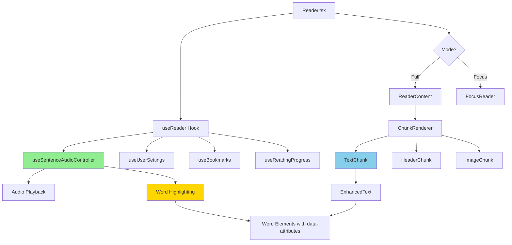
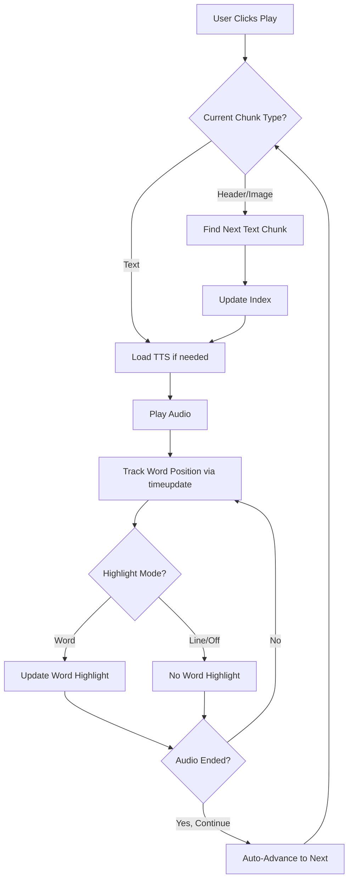
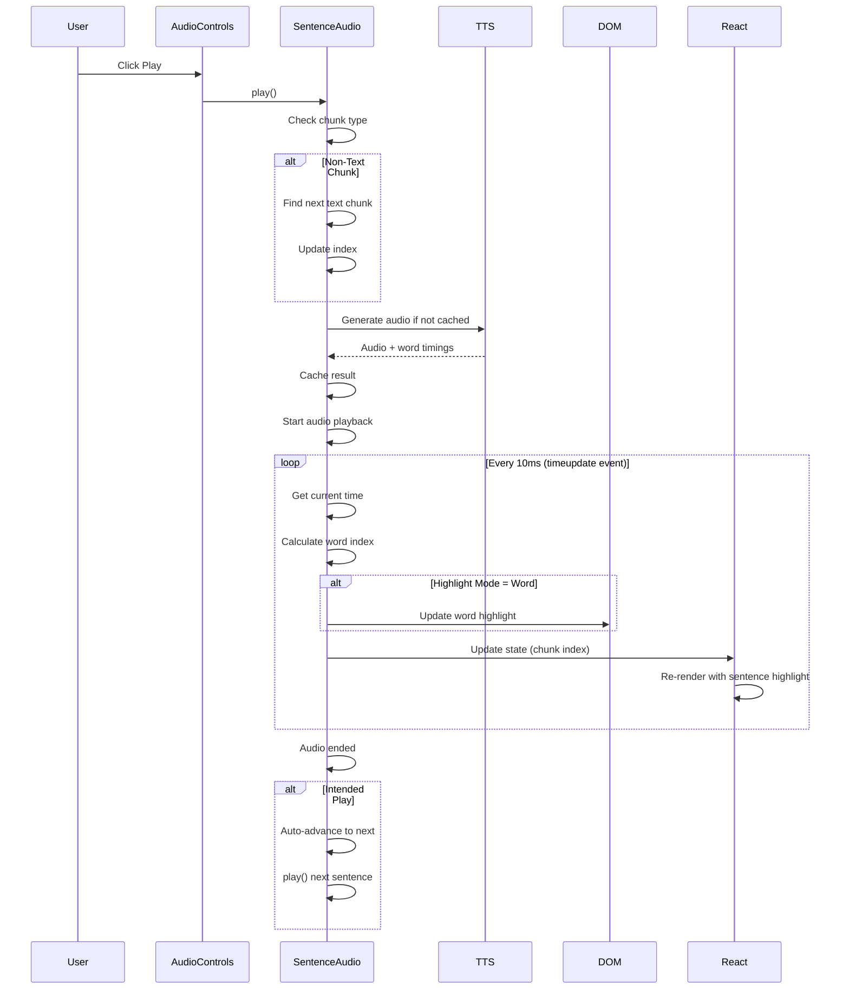
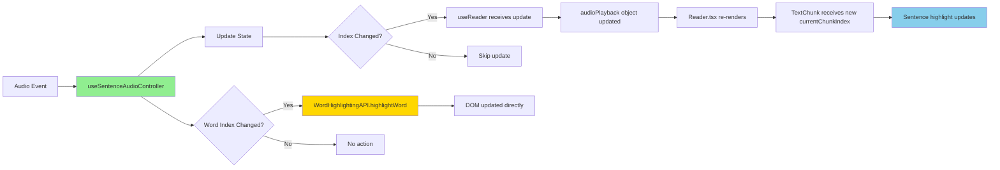

# Reader Architecture Documentation

## Overview

The Reader is a sentence-based audio book player with real-time highlighting, supporting both **Full Mode** (shows entire chapter with scrolling) and **Focus Mode** (shows one sentence at a time). The implementation uses a simplified one-to-one index mapping where **sentence indices equal chunk indices**, eliminating the need for complex index translation.

## Table of Contents

1. [Core Principles](#core-principles)
2. [Architecture Overview](#architecture-overview)
3. [Simplified Index System](#simplified-index-system)
4. [Audio Playback System](#audio-playback-system)
5. [Highlighting Systems](#highlighting-systems)
6. [Component Structure](#component-structure)
7. [Data Flow](#data-flow)
8. [Key Features](#key-features)
9. [Usage Examples](#usage-examples)
10. [Performance Optimizations](#performance-optimizations)

## Core Principles

### 1. Sentence Index = Chunk Index
The most important architectural decision: sentence indices directly correspond to chunk indices in the chapter. No filtering, no mapping, no translation.

```typescript
// ✅ SIMPLIFIED (Current Implementation)
const sentences = chapter?.content?.chunks || [];  // ALL chunks
const currentChunkIndex = sentenceAudio.currentSentenceIndex;  // Direct match!

// ❌ OLD (Complex Implementation)
const sentences = chunks.filter(c => c.type === 'text');  // Filtered array
const currentChunkIndex = sentenceToChunkIndex(sentenceIndex);  // Mapping required
```

### 2. Skip Non-Text Chunks in Audio
Headers and images are included in the array but skipped during TTS generation and playback.

```typescript
if (chunk.type !== 'text' || !chunk.text?.trim()) {
    // Skip TTS, auto-advance to next text chunk
    return;
}
```

### 3. Unified Audio Controller
Both Full and Focus modes use the same `useSentenceAudioController` hook with the same index system.

### 4. DOM-Based Word Highlighting
Word-level highlighting uses direct DOM manipulation for performance, while sentence-level highlighting uses React's declarative rendering.

## Architecture Overview



## Simplified Index System

### How It Works

**Chapter Structure:**
```typescript
chapter.content.chunks = [
    { index: 0, type: 'header', text: 'Chapter Title' },
    { index: 1, type: 'text', text: 'First paragraph...' },
    { index: 2, type: 'text', text: 'Second paragraph...' },
    { index: 3, type: 'image', imageName: 'figure1.jpg' },
    { index: 4, type: 'text', text: 'Third paragraph...' },
    // ...
]
```

**Sentence Array (No Filtering!):**
```typescript
// useSentenceAudioController.ts
const sentences = chapter?.content?.chunks || [];  // ALL chunks!

// Sentence index 0 = Chunk index 0 (header)
// Sentence index 1 = Chunk index 1 (text)
// Sentence index 2 = Chunk index 2 (text)
// Sentence index 3 = Chunk index 3 (image)
// Sentence index 4 = Chunk index 4 (text)
```

**Benefits:**
- ✅ No mapping function needed
- ✅ Direct array access: `sentences[chunkIndex]`
- ✅ Simple debugging: indices match everywhere
- ✅ Cleaner code: 40+ lines removed

### How Non-Text Chunks Are Handled

**TTS Generation:**
```typescript
const loadSentence = async (index: number) => {
    const chunk = sentences[index];
    
    // Skip non-text chunks silently
    if (chunk.type !== 'text' || !chunk.text?.trim()) {
        return;  // No TTS generated
    }
    
    // Generate TTS only for text chunks
    await generateTts({ text: chunk.text, ... });
};
```

**Playback:**
```typescript
const play = async () => {
    const chunk = sentences[currentSentenceIndex];
    
    // Auto-advance past headers/images
    if (chunk.type !== 'text') {
        const nextTextIndex = sentences.findIndex(
            (c, i) => i > currentSentenceIndex && c.type === 'text'
        );
        if (nextTextIndex !== -1) {
            goToSentence(nextTextIndex);
            setTimeout(() => play(), 50);
        }
        return;
    }
    
    // Play text chunk normally
    await loadSentence(currentSentenceIndex);
    // ...
};
```

**Navigation:**
```typescript
const nextSentence = () => {
    // Find next text chunk
    const nextTextIndex = sentences.findIndex(
        (c, i) => i > currentSentenceIndex && c.type === 'text'
    );
    if (nextTextIndex !== -1) {
        goToSentence(nextTextIndex);
    }
};

const prevSentence = () => {
    // Find previous text chunk
    for (let i = currentSentenceIndex - 1; i >= 0; i--) {
        if (sentences[i]?.type === 'text' && sentences[i]?.text?.trim()) {
            goToSentence(i);
            break;
        }
    }
};
```

## Audio Playback System

### useSentenceAudioController Hook

The central hook managing all audio playback:

```typescript
export function useSentenceAudioController(
    chapter: ChapterClient | null,
    selectedVoice: string,
    selectedProvider: TtsProvider,
    playbackSpeed: number,
    ttsEnabled: boolean,
    initialSentenceIndex: number | null,
    initialWordIndex: number | null,
    highlightMode: 'word' | 'line' | 'off'
): SentenceAudioApi
```

**Key Features:**
- Manages audio state (playing, current index, etc.)
- Generates TTS on-demand with caching
- Tracks word timing for word-level highlighting
- Handles auto-advance at sentence end
- Pre-loads adjacent sentences for smooth playback

### Audio State

```typescript
interface SentenceAudioState {
    currentSentenceIndex: number;  // Current chunk index (sentence index = chunk index!)
    currentWordIndex: number;       // Current word within sentence
    isPlaying: boolean;             // Playback state
    intendedPlay: boolean;          // User wants continuous play
    ttsError: string | null;        // Error message
    ttsServiceAvailable: boolean;   // TTS service status
}
```

### TTS Generation & Caching

```typescript
// Cache structure: { [chunkIndex]: { src: string, timepoints: Array } }
const cacheRef = useRef<Record<number, {
    src: string;
    timepoints: Array<{ time: number; wordIndex: number }>;
}>>({});

const loadSentence = async (index: number) => {
    // Skip if already cached
    if (cacheRef.current[index]) return;
    
    // Skip non-text chunks
    if (chunk.type !== 'text') return;
    
    // Generate TTS with word timing
    const result = await generateTts({
        text: chunk.text,
        provider: selectedProvider,
        voiceId: selectedVoice
    });
    
    // Cache audio + word timings
    cacheRef.current[index] = {
        src: `data:audio/mp3;base64,${result.audioContent}`,
        timepoints: result.timepoints.map((tp, i) => ({
            time: tp.timeSeconds,
            wordIndex: i
        }))
    };
};
```

### Playback Flow



## Highlighting Systems

### Two Independent Systems

1. **Sentence Highlighting**: React-based, highlights entire sentence with background color
2. **Word Highlighting**: DOM-based, highlights individual word during playback

Both respect the `highlightMode` setting: `'word'`, `'line'`, or `'off'`.

### Sentence Highlighting (React-Based)

Simple conditional className application:

```typescript
// TextChunk.tsx
<div
    style={{
        backgroundColor: currentChunkIndex === chunkIndex 
            ? 'var(--sentence-highlight-color, transparent)' 
            : 'transparent'
    }}
    data-chunk-index={chunkIndex}
>
    {/* Content */}
</div>
```

**How it works:**
1. `currentChunkIndex` comes from audio controller
2. Each text chunk knows its own `chunkIndex`
3. When they match → apply sentence highlight color
4. React re-renders automatically when `currentChunkIndex` changes

### Word Highlighting (DOM-Based)

Direct DOM manipulation for performance:

```typescript
// WordHighlightingAPI.ts
export const WordHighlightingAPI = {
    highlightWord: (chunkIndex: number, wordIndex: number) => {
        const element = document.querySelector(
            `[data-word-id="chunk-${chunkIndex}-word-${wordIndex}"]`
        );
        if (element) {
            element.classList.add('highlight-word');
        }
    },
    
    unhighlightWord: (chunkIndex: number, wordIndex: number) => {
        const element = document.querySelector(
            `[data-word-id="chunk-${chunkIndex}-word-${wordIndex}"]`
        );
        if (element) {
            element.classList.remove('highlight-word');
        }
    }
};
```

**Word Elements:**
```typescript
// EnhancedText.tsx
<span
    data-chunk-index={chunkIndex}
    data-word-index={wordIndex}
    data-word-id={`chunk-${chunkIndex}-word-${wordIndex}`}
>
    {word}
</span>
```

**Highlight Update:**
```typescript
// useSentenceAudioController.ts
useEffect(() => {
    if (highlightMode !== 'word') return;
    if (!state.isPlaying) return;
    
    // Remove previous highlight
    if (previous) {
        WordHighlightingAPI.unhighlightWord(
            previous.sentenceIndex,  // = chunk index!
            previous.wordIndex
        );
    }
    
    // Add new highlight (no mapping needed!)
    WordHighlightingAPI.highlightWord(
        currentSentenceIndex,  // = chunk index!
        currentWordIndex
    );
}, [state.isPlaying, state.currentSentenceIndex, state.currentWordIndex]);
```

**CSS:**
```css
.highlight-word {
    background-color: var(--word-highlight-color, transparent);
    border-radius: 3px;
    box-shadow: 0 2px 3px rgba(0, 0, 0, 0.1);
    transition: all 0.2s ease;
}
```

## Component Structure

### Reader.tsx (Main Component)

The root component that orchestrates everything:

```typescript
export const Reader = () => {
    const { settings: appSettings } = useSettings();
    const {
        book,
        chapter,
        loading,
        audio,
        settings,
        bookmarks,
        navigation,
        progress,
        sentenceAudio
    } = useReader();
    
    const isFocusMode = appSettings.readingMode === 'focus';
    
    return (
        <UserThemeProvider {...settings}>
            {/* Mode Toggle */}
            <ToggleButtonGroup value={isFocusMode ? 'focus' : 'full'}>
                <ToggleButton value="full">Full</ToggleButton>
                <ToggleButton value="focus">Focus</ToggleButton>
            </ToggleButtonGroup>
            
            {/* Content */}
            {isFocusMode ? (
                <FocusReader controller={sentenceAudio.controller} />
            ) : (
                <ReaderContent
                    chapter={chapter}
                    currentChunkIndex={audio.currentChunkIndex}
                    {...props}
                />
            )}
            
            {/* Audio Controls */}
            <AudioControls
                onPlay={sentenceAudio.controller.play}
                onPause={sentenceAudio.controller.pause}
                onNext={sentenceAudio.controller.nextSentence}
                onPrev={sentenceAudio.controller.prevSentence}
                {...controlProps}
            />
        </UserThemeProvider>
    );
};
```

### useReader Hook

Central state management hook:

```typescript
export const useReader = () => {
    // Load book and chapter data
    const [state, setState] = useState<ReaderState>({
        book: null,
        chapter: null,
        currentChapterNumber: null,
        currentChunkIndex: null,
        loading: true,
        error: null
    });
    
    // Initialize audio controller (simplified - no mapping!)
    const sentenceAudio = useSentenceAudioController(
        state.chapter,
        userSettings.selectedVoice,
        userSettings.selectedProvider,
        userSettings.playbackSpeed,
        userSettings.ttsEnabled,
        state.currentChunkIndex ?? 0,
        0,
        userSettings.highlightMode
    );
    
    // Create audio playback adapter
    const audioPlayback = {
        currentChunkIndex: sentenceAudio.currentSentenceIndex,  // Direct!
        currentWordIndex: sentenceAudio.currentWordIndex,
        isPlaying: sentenceAudio.isPlaying,
        // ...
    };
    
    return {
        book: state.book,
        chapter: state.chapter,
        audio: audioPlayback,
        settings: userSettings,
        sentenceAudio,
        // ...
    };
};
```

### ReaderContent (Full Mode)

Renders the entire chapter with scrolling:

```typescript
export const ReaderContent = ({
    chapter,
    currentChunkIndex,
    ...props
}) => {
    // Group chunks by paragraph
    const paragraphGroups = useParagraphGrouping(chapter.content.chunks);
    
    return (
        <Box>
            <ChunkRenderer
                paragraphGroups={paragraphGroups}
                currentChunkIndex={currentChunkIndex}
                {...props}
            />
        </Box>
    );
};
```

### ChunkRenderer

Renders different chunk types:

```typescript
export const ChunkRenderer = ({
    paragraphGroups,
    currentChunkIndex,
    ...props
}) => {
    const renderChunk = (chunk: TextChunkClient) => {
        switch (chunk.type) {
            case 'header':
                return <HeaderChunk chunk={chunk} chunkIndex={chunk.index} />;
            
            case 'image':
                return <ImageChunk chunk={chunk} chunkIndex={chunk.index} />;
            
            case 'text':
            default:
                return (
                    <TextChunk
                        chunk={chunk}
                        chunkIndex={chunk.index}  // Original chunk index!
                        currentChunkIndex={currentChunkIndex}
                        {...props}
                    />
                );
        }
    };
    
    return (
        <>
            {paragraphGroups.map(group => (
                <Box key={group.paragraphIndex}>
                    {group.chunks.map(chunk => renderChunk(chunk))}
                </Box>
            ))}
        </>
    );
};
```

### TextChunk Component

Renders individual text chunk with highlighting:

```typescript
export const TextChunk = ({
    chunk,
    chunkIndex,
    currentChunkIndex,
    handleLinkClick
}) => {
    const isHighlighted = currentChunkIndex === chunkIndex;
    
    return (
        <div
            style={{
                backgroundColor: isHighlighted 
                    ? 'var(--sentence-highlight-color, transparent)' 
                    : 'transparent'
            }}
            id={`text-chunk-${chunkIndex}`}
            data-chunk-index={chunkIndex}
            data-paragraph-index={chunk.paragraphIndex}
        >
            <EnhancedText
                chunk={chunk}
                chunkIndex={chunkIndex}
                onLinkClick={handleLinkClick}
            />
        </div>
    );
};
```

### EnhancedText Component

Renders words with data attributes for highlighting:

```typescript
export const EnhancedText = ({ chunk, chunkIndex }) => {
    const renderTextWithHighlighting = (text: string) => {
        const words = text.split(/\s+/);
        return (
            <>
                {words.map((word, wordIndex) => (
                    <span
                        key={wordIndex}
                        data-chunk-index={chunkIndex}
                        data-word-index={wordIndex}
                        data-word-id={`chunk-${chunkIndex}-word-${wordIndex}`}
                    >
                        {word}
                    </span>
                ))}
            </>
        );
    };
    
    return <span>{renderTextWithHighlighting(chunk.text)}</span>;
};
```

### FocusReader (Focus Mode)

Shows one sentence at a time in large text:

```typescript
export const FocusReader = ({ controller, highlightMode }) => {
    const currentSentence = controller.sentences[controller.currentSentenceIndex];
    const currentWords = currentSentence?.text.split(/\s+/) || [];
    
    return (
        <Box>
            <Typography variant="h4">
                {currentWords.map((word, i) => (
                    <span
                        key={i}
                        className={
                            highlightMode === 'word' && 
                            controller.isPlaying && 
                            i === controller.currentWordIndex
                                ? 'highlight-word'
                                : ''
                        }
                        data-word-index={i}
                    >
                        {word}{' '}
                    </span>
                ))}
            </Typography>
        </Box>
    );
};
```

## Data Flow

### Playback Flow



### State Update Flow



## Key Features

### 1. Dual Mode Support

**Full Mode:**
- Shows entire chapter
- Scrollable content
- Sentence highlighting follows audio
- "Scroll to current" FAB when out of view

**Focus Mode:**
- One sentence at a time
- Large, centered text
- Minimal distractions
- Previous/Next sentence preview

### 2. Real-Time Highlighting

**Word-Level (DOM-based):**
- Updates every 10ms during playback
- No React re-renders
- Smooth, performant
- Configurable color

**Sentence-Level (React-based):**
- Updates when sentence changes
- Automatic with React
- Configurable background color

### 3. Automatic Progress Tracking

- Saves current position (chapter + chunk)
- Tracks reading time and sessions
- Syncs with server
- Restores position on reload

### 4. Bookmarks

- Quick-add with audio controls
- Jump to bookmarked position
- Persists across sessions
- Chapter + chunk index stored

### 5. Theme Customization

- Font size, family, line height
- Text color
- Word highlight color
- Sentence highlight color
- Light/Dark theme

### 6. Speed Control

- Playback speed (0.5x - 2.0x)
- Voice selection (multiple providers)
- TTS provider selection
- Word timing offset adjustment

## Usage Examples

### Basic Playback

```typescript
// Get audio controller from useReader
const { sentenceAudio } = useReader();

// Play current sentence
sentenceAudio.controller.play();

// Pause
sentenceAudio.controller.pause();

// Next sentence (finds next text chunk automatically)
sentenceAudio.controller.nextSentence();

// Previous sentence (finds previous text chunk)
sentenceAudio.controller.prevSentence();

// Jump to specific chunk
sentenceAudio.controller.goToSentence(42);  // Chunk index 42
```

### Highlighting Control

```typescript
// Set highlight mode
updateSettings({ highlightMode: 'word' });  // or 'line' or 'off'

// Customize colors
updateSettings({
    highlightColor: '#ffeb3b',           // Word highlight
    sentenceHighlightColor: '#e3f2fd'    // Sentence highlight
});
```

### Navigation

```typescript
// Change chapter
navigation.setCurrentChapterNumber(5);

// Jump to bookmark
navigation.handleNavigateToBookmark(chapterNumber, chunkIndex);

// Previous/Next chapter
navigation.handlePreviousChapter();
navigation.handleNextChapter();
```

## Performance Optimizations

### 1. TTS Caching
```typescript
// Cache structure prevents re-generation
const cacheRef = useRef<Record<number, { src: string; timepoints: Array }>({});

// Check cache before generating
if (cacheRef.current[index]) {
    // Use cached audio
    return;
}
```

### 2. Pre-loading Adjacent Sentences
```typescript
useEffect(() => {
    const currentIndex = state.currentSentenceIndex;
    const adjacentIndices = [currentIndex - 1, currentIndex + 1]
        .filter(i => i >= 0 && i < sentences.length);
    
    // Pre-load for smooth transitions
    adjacentIndices.forEach(i => loadSentence(i));
}, [state.currentSentenceIndex]);
```

### 3. DOM-Based Word Highlighting
```typescript
// No React re-renders for word updates
useEffect(() => {
    // Direct DOM manipulation
    WordHighlightingAPI.highlightWord(chunkIndex, wordIndex);
}, [state.currentWordIndex]);
```

### 4. Efficient Chunk Rendering
```typescript
// Only re-renders when currentChunkIndex changes
const isHighlighted = currentChunkIndex === chunkIndex;
```

### 5. Ref-Based State Tracking
```typescript
// Avoid stale closures in intervals
const stateRef = useRef(state);
useEffect(() => { stateRef.current = state; }, [state]);

// Use in async callbacks
const currentState = stateRef.current;
```

---

## Migration from Old System

If you're familiar with the old implementation:

### What Changed

**Before:**
```typescript
// Filtered array
const sentences = chunks.filter(c => c.type === 'text');
// Mapping function needed
const chunkIndex = sentenceToChunkIndex(sentenceIndex);
// Complex index translation
```

**After:**
```typescript
// All chunks
const sentences = chapter?.content?.chunks || [];
// Direct mapping
const chunkIndex = sentenceIndex;  // They're the same!
// No translation needed
```

### Benefits

- ✅ **40+ lines of code removed**
- ✅ **No `sentenceToChunkIndex` function**
- ✅ **Simpler debugging** (indices match everywhere)
- ✅ **Easier to understand**
- ✅ **Same functionality**

---

**For more details on highlighting systems, see:**
- [Highlighting Systems Documentation](../../../docs/highlighting-systems.md)

**Related Components:**
- `AudioControls.tsx` - Playback controls UI
- `ThemeModal.tsx` - Theme customization
- `SpeedControlModal.tsx` - Speed and voice settings

